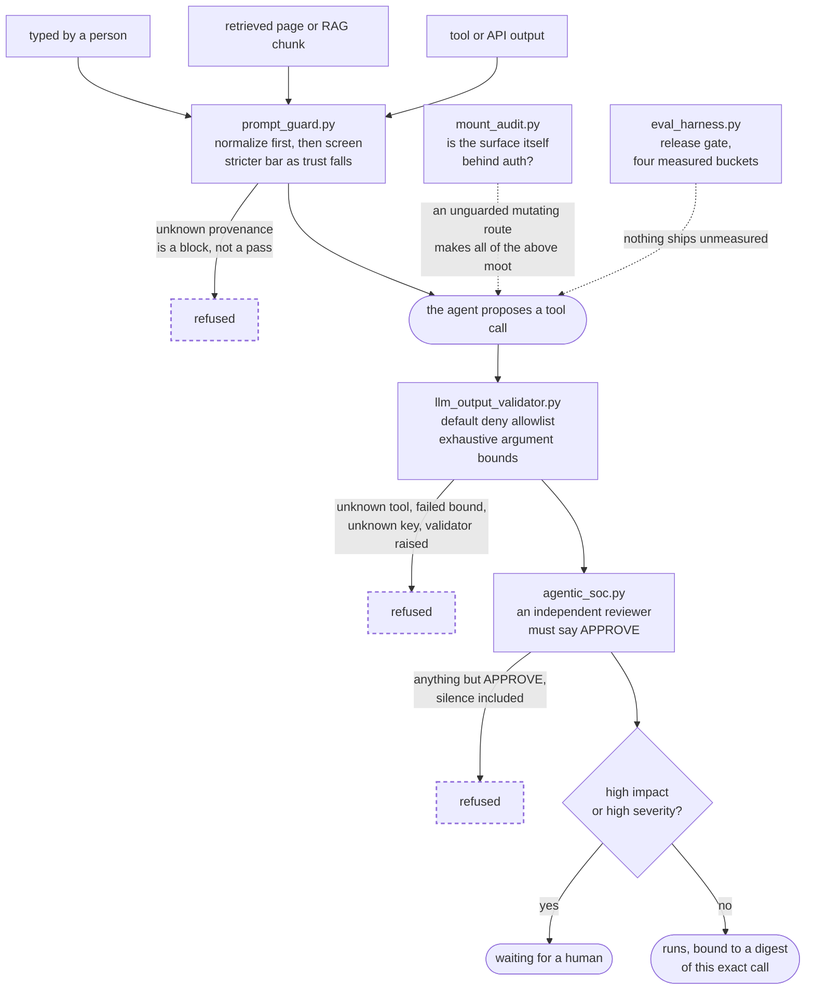
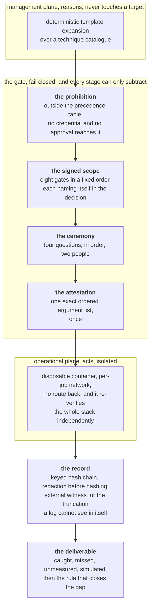
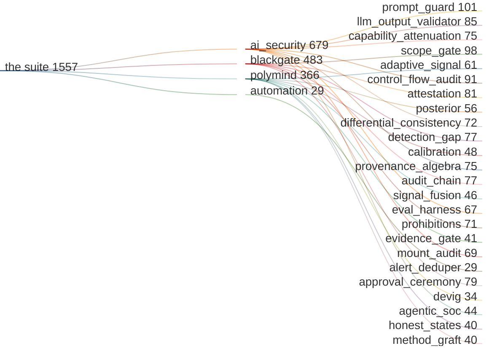

<div align="center">

# Agentic AI · Security · Autonomous Systems

I build multi-model research systems, security controls, and automation. This repository presents small, runnable examples from that work, with architecture diagrams, tests, and documented limitations.

[](https://github.com/greeklinux/Showcase/actions/workflows/tests.yml)

[Portfolio](https://uliseshurtado.com) · [PolyMind Atlas](https://polymindatlas.uliseshurtado.com)

Python standard library · Synthetic examples · Private-system architecture

</div>

---

## `> start here`

| Directory | What is in it | Size |
| --- | --- | --- |
| [**`blackgate/`**](blackgate/) &nbsp; **BlackGate** | The safety architecture of an authorized, human-gated adversary emulation and purple team platform: two physically separated planes, a fail-closed scope gate, an approval bound to one exact ordered argument list, a four-stage two-person ceremony, the prohibition no approval reaches, a keyed audit chain with an external witness, and the scoring loop that closes the detection gap. | 6 modules, 483 tests |
| [`polymind/`](polymind/) | Sanitized slices of a private multi-model research platform. Evidence gating, calibration, an honest state vocabulary, and a posterior scored against the market price rather than a coin flip. | 8 modules, 366 tests |
| [`ai_security/`](ai_security/) | Defense in depth for autonomous systems: input guard, output guard, mount-surface auditor, release gate, multi-agent SOC triage, and four pathways that ask whether a control is wired to the decision at all. | 9 modules, 679 tests, 3 KQL hunts |
| [`automation/`](automation/) | Alert deduplication with severity-first ordering and documented grouping tradeoffs. | 1 module, 29 tests |
| [`docs/THEMES.md`](docs/THEMES.md) | The cross-cutting index: five ideas, every place each one appears, and where each one is absent. | 1 index |
| [`docs/diagrams/`](docs/diagrams/) | Captioned, reusable diagram sources, each stating what it can be checked against. | 10 diagrams |
| [`tests/`](tests/) | One test file per module, named as sentences. Standard library `unittest`, plus a mutation harness that breaks the code on purpose to prove the suite can fail. | 1,557 tests |
| [`GOVERNANCE.md`](GOVERNANCE.md) &middot; [`SECURITY.md`](SECURITY.md) | Framework mappings, control requirements, claim boundaries, and vulnerability disclosure policy. | 2 documents |

---

## Engineering approach

I design systems around explicit authorization, measurable behavior, and traceable decisions. These examples focus on how controls affect execution, how incomplete evidence is represented, and how tests detect regressions. They are representative educational extracts; private systems and sensitive operational data are outside this repository.

---

## 🧩 &nbsp; The shape of the work

One agent action, end to end, with every control this repository contains sitting on the path it actually defends. Solid lines are the request. Dashed lines are the controls that decide whether the path is allowed to exist at all.



Three design principles:

- **Every gate can only subtract.** No stage can re-admit something an earlier stage refused, so reading the chain left to right is the whole authorization story.
- **A refusal is a named outcome, not an exception.** The record says which gate stopped the action, and keeps *nothing needed doing* distinct from *something needed doing and is waiting for a person*. Those look identical on a dashboard that only tracks whether an action ran, and they are opposites.
- **The mounted surface is a control too.** You cannot audit authorization by reading route handlers, because the handler is not where the coverage lives.

---

## 🧵 &nbsp; Five ideas, and where each one is in the code

Five recurring design principles connect the project directories. The table links each principle to a representative implementation.

| | The idea | The mechanism, in one line | The sharpest single instance |
| --- | --- | --- | --- |
| **1** | **A control that is written and not in effect** | A control exists in source but its result never reaches the authorization decision. | [`control_flow_audit.py`](ai_security/control_flow_audit.py) parses the source and reports the verdicts that never reach the decision they govern |
| **2** | **Fail-closed authorization** | Reject unknown, invalid, or incomplete inputs at each authorization boundary. | BlackGate's [`scope_gate.py`](blackgate/scope_gate.py): eight gates in a fixed order, each able only to refuse, each naming itself in the decision |
| **3** | **Four states, never collapsed** | *Not measured*, *measured and found nothing*, *measured*, *not available*. Merging the first two is how a failed read renders as a reassuring zero. | [`honest_states.py`](polymind/honest_states.py) keeps the naive renderer in the file so the difference is visible rather than asserted |
| **4** | **A method you may copy, a measurement you may not** | A procedure ports. A number earned by one specific thing does not, and copying it destroys the only test of whether the copy worked. | [`method_graft.py`](polymind/method_graft.py) raises `UnearnedClaimError` rather than skipping silently |
| **5** | **An approval names one exact action** | A bare yes is a bearer token. It says yes without saying yes to what. | BlackGate's [`attestation.py`](blackgate/attestation.py) binds a hash of the exact ordered argument list into the signed payload |

> [!TIP]
> **[`docs/THEMES.md`](docs/THEMES.md) is the full index.** Every instance of
> every theme, in every directory, with a link to the file, plus the state
> machine of the five mechanical shapes a dead control takes and the sequence
> diagram of what an unbound approval actually authorizes. It also records where
> a theme is **absent**: theme 2 and theme 5 do not reach `automation/`, and
> theme 5 does not reach `polymind/`.

---

## 🩺 &nbsp; The finding that organizes all of this

> [!IMPORTANT]
> The review identified five controls that were **present in code but did not affect the decision they were intended to govern**. The examples below document the failure and the corresponding correction.

| Where | Control intent | Failure scenario | Control design |
| --- | --- | --- | --- |
| [`agentic_soc.py`](ai_security/agentic_soc.py) | A reviewer agent was called and its verdict was placed in the response. | `auto_execute` was computed from alert severity alone. The reviewer's answer was never read. | Every gate can only subtract, and an answer that cannot be parsed is a rejection. Silence is not consent. |
| [`llm_output_validator.py`](ai_security/llm_output_validator.py) | `requires_human=True` was returned to the caller. | Nothing honored it. A control that lives only in a returned field is one forgotten `if` away from not existing. | `execute()` holds the gate itself and refuses to run without an approval bound to a digest of that exact tool and those exact arguments, so approval for one call does not authorize a different call. |
| [`eval_harness.py`](ai_security/eval_harness.py) | The release gated on safety and injection scores. | An agent that refuses every request scores a perfect 1.0 on both and ships. An empty bucket also scored 1.0, so a suite that had lost its safety cases reported perfect safety. | Four buckets, gated on all four, with **helpfulness** as the opposing metric. An empty bucket returns None and a gate over None fails by name as *not measured*. |
| [`oauth_consent_grant.kql`](ai_security/detections/oauth_consent_grant.kql) | `AdminConsent = OperationName has "admin"`. | None of the operation names the query filters on contains the word "admin", so the column an analyst triages on was false on every row, forever. | Admin consent is read out of `modifiedProperties` by name, with `mv-apply`, not by array position. |
| [`anomalous_signin.kql`](ai_security/detections/anomalous_signin.kql) | A home-country exclusion list, to cut noise. | The exclusion only fires when **both** countries are on the list, and the filter above it already requires the two countries to differ. A one-entry list could never exclude anything. | The condition the list needs in order to be real is stated in the file, next to the list. A filter that cannot fire is not a lenient filter, it is an absent one. |

There are **seventeen** instances of this shape catalogued across the four
directories, including the one
[`mount_audit.py`](ai_security/mount_audit.py) exists for, the prohibition in
[`prohibitions.py`](blackgate/prohibitions.py) that the strongest credential
could legally lift, and the generated detection rules in
[`detection_gap.py`](blackgate/detection_gap.py) that matched zero events
forever. Each has its own row in
[`docs/THEMES.md`](docs/THEMES.md#1--a-control-that-is-written-and-not-in-effect).

**Why document the original defects?** Comparing the failure with its correction makes the control boundary reviewable and explains the regression tests.

---

<a id="blackgate"></a>

## 🔐 &nbsp; BlackGate &nbsp;·&nbsp; Authorized Adversary Emulation, Human Gated &nbsp;·&nbsp; [`blackgate/`](blackgate/)

**BlackGate** is my private platform for **authorized, human-gated security testing**. Its design connects scoped adversary emulation with detection assessment and generation of detection content. The public modules demonstrate its safety controls using synthetic inputs.

The **safety architecture** defines the conditions required before a command can execute. Two physically separated planes, one that reasons and never touches a
target and one that acts inside disposable hardened containers on a per-job
network with no route back. A gate stack between them that can only subtract. A
keyed, tamper-evident record underneath both, witnessed from outside, because a
log cannot certify its own completeness.



Six modules contribute **483 of the suite's 1,557 tests**, covering the failure modes described below.

**Implementation scope.** This is an architectural illustration. The public
modules exercise approval, scope, integrity and scoring logic with synthetic
inputs. They do not include an execution service or attest to private runtime
state.

**Key mechanism.** Denial-of-service and anti-forensic actions are unconditional prohibitions in this design. Approval levels cannot override them. `python3 blackgate/prohibitions.py` demonstrates the banned tool at every approval level:

```
  none                   REFUSE PROHIBITION    packet_flood is in the denial_of_service class, which is banned unconditionally
  operator               REFUSE PROHIBITION    packet_flood is in the denial_of_service class, which is banned unconditionally
  ceremony_complete      REFUSE PROHIBITION    packet_flood is in the denial_of_service class, which is banned unconditionally
  client_countersigned   REFUSE PROHIBITION    packet_flood is in the denial_of_service class, which is banned unconditionally
  emergency_override     REFUSE PROHIBITION    packet_flood is in the denial_of_service class, which is banned unconditionally
  root                   REFUSE PROHIBITION    packet_flood is in the denial_of_service class, which is banned unconditionally
```

Six identical lines are the whole argument. `resolve()` takes one parameter, a
request. There is no approval argument, no override, no force. The most reliable
way to stop an override being added later is for there to be **nowhere to put
one**.

**Action-bound approval.** An approval is usually stored as a
boolean, and a boolean is a bearer token: it says yes without saying yes to
what. In [`attestation.py`](blackgate/attestation.py) the approval is a signed
statement carrying a hash of the **exact ordered argument list**, recomputed
from the arguments actually about to run, so approving a read-only invocation of
a tool cannot authorize the destructive invocation of the same tool, which
differs only in its arguments. One argument changed, appended, removed or
reordered is a refusal, and the refusal names both hashes.

**Failure mode.** Generated detection rules matched a MITRE technique identifier in command lines that did not contain it. Valid syntax and identifiers therefore overstated detection coverage. This resembles the non-firing exclusion in [`anomalous_signin.kql`](ai_security/detections/anomalous_signin.kql). Across three independent systems, the corrective principle is to test whether a control can affect its intended input. [`detection_gap.py`](blackgate/detection_gap.py) rejects a generated rule when its selection names no field carried by its log source.

**Further reading.** **[`blackgate/README.md`](blackgate/README.md)** walks all six
modules in the order a request meets them, the defect behind each, the real
printed run of each one, the ATT&CK and NIST mapping with four mappings
declined, and the thirty eight mutations
the harness plants in this directory and the properties they exercise. These public modules demonstrate refusal, binding, recording, and scoring;
all addresses are RFC 5737 documentation ranges, all names are `.invalid`, and
every time value is an integer tick supplied by the caller.

---

## 🤖 &nbsp; Autonomous AI Systems &nbsp;·&nbsp; [`polymind/`](polymind/)

**PolyMind** is my multi-model prediction-market research platform: a roster of large language models that each analyze the same market independently, place simulated trades under their own simulated bankrolls, have every outcome resolved against ground truth, and are scored on calibration and realized record from there on. The full engine is private. The eight files in [`polymind/`](polymind/) are sanitized slices that show how the hard parts work.

**Scope.** These public examples use synthetic inputs and place no real orders.
They demonstrate evaluation mechanisms, not investment performance or the
current configuration of the private platform.

**Key mechanism.** The null is not a coin flip. A seat that
only ever backed the favourite in a book of heavy favourites will hit the
favourite rate forever while contributing nothing, so the bar is the rate you
would have got by taking the pre-decision favourite on exactly those same rows.
`python3 polymind/posterior.py` prints the argument as arithmetic:

```
A: 74 of 120, in a book where the favourite hit 73 of 120
  settled             120
  raw_rate            0.6167
  posterior_mean      0.6148
  wilson_lower_95     0.5273
  price_implied_null  0.6083
  margin_over_null    -0.081
  rule                measured, nothing beat the null
  action              EVALUATED_NEUTRAL
  vs a coin flip its lower bound looks like an edge; vs the price it is not
```

Scoring against 0.50 is how matching the market gets paid like skill. The module
**refuses to score** when the null is missing rather than falling back to a
majority-class baseline, because the fallback is the bug.

**Failure mode.** Marked placeholders can be mistaken for observed results by
a downstream consumer. [`evidence_gate.py`](polymind/evidence_gate.py) shows a
shared screening predicate with three channels and explicitly lower-bound
counts. It keeps missing evidence distinct from measured performance.

**Further reading.** [`polymind/README.md`](polymind/README.md) walks all eight modules,
their assumptions, reproducible examples, and design principles. The architecture itself is a clickable, interactive showcase at
**[polymindatlas.uliseshurtado.com](https://polymindatlas.uliseshurtado.com)**.

---

## 🛡️ &nbsp; AI Security &nbsp;·&nbsp; [`ai_security/`](ai_security/)

An agentic system has two attack surfaces, what goes **in** and what comes
**out**, and a deployment surface: **what it is mounted on**.
Five modules guard those three. Four more sit underneath and ask a different
question: not "is a rule missing" but "is the model of the system wrong",
because a wrong model is what produces a control that is present and not in
effect. Three Sentinel KQL hunts carry the detection side.

**Key mechanism.** An approval must name the exact call. A bare
"yes, approved" flag is replayable: approve a lookup once and the same approval
waves through a later account disable. Here approvals are bound to a SHA-256
digest of the exact tool and arguments, over a canonical JSON form with sorted
keys. `python3 ai_security/llm_output_validator.py` ends on three lines:

```
HELD [isolate_endpoint]: human approval required for call a062742dc4415a5bab30a13f5ad0b98789f876870cef2969fa1adeb99fae87e9
RAN isolate_endpoint {'device_id': 'HOST-42'}
HELD [disable_user]: human approval required for call 68a66649f205054e47f5c15e9528cc1fcad6e0b676a417b21796231fd98a5f8a
```

Line one holds for want of an approval. Line two runs, because the approval
names the digest on line one. Line three presents **the same approval token**
for a `disable_user` call, and it is held, because that call digests to the
different value on line three. `execute()` holds the gate itself rather than
returning a flag, because a control that depends on the caller doing the steps
in the right order is one refactor away from not existing.

**Digest strength.** The example uses the full SHA-256 digest to bind an
approval to a canonical tool call. This demonstrates exact-call matching,
not authentication or single-use authorization. A deployment also needs a
trusted approval issuer, expiry, and replay protection; the signed-attestation
example in [`blackgate/attestation.py`](blackgate/attestation.py) demonstrates
separate controls for those concerns.

**Failure mode.** The first version of
[`agentic_soc.py`](ai_security/agentic_soc.py) had a reviewer agent that did not
review. It called a reviewer model, put the answer in the response dictionary,
and then computed `auto_execute` from the alert severity alone. The control was
in the architecture diagram, in the code, and in the output, and it was not in
the decision. This failure is what
[`control_flow_audit.py`](ai_security/control_flow_audit.py) was built to find
mechanically, and two tests run that analyzer against this directory's own
shipped modules so the shape cannot come back unnoticed.

**Further reading.** [`ai_security/README.md`](ai_security/README.md) walks all nine
modules and all three hunts, and carries the full framework mapping: every
OWASP, ATLAS, ATT&CK and NIST identifier checked against its publishing source
with the edition it currently carries, plus **nine mappings deliberately
declined** with the reason for each.

---

## ⚙️ &nbsp; Alert Automation &nbsp;·&nbsp; [`automation/`](automation/)

Repeated alerts can obscure higher-severity events. This module groups related alerts and prioritizes the resulting digests by severity.
[`alert_deduper.py`](automation/alert_deduper.py) collapses a storm into one
digest per source, rule, and entity group.

**Key mechanism.** The interesting decision is not the
grouping, it is **what the key leaves out**.
`python3 automation/alert_deduper.py`:

```
201 raw alerts -> 2 actionable digests
  sev4 x  1  [malware_detected] fired 1x on HOST-42. Likely one root cause. Sample: 'Trojan.Generic quarantined'
  sev2 x200  [port_scan] fired 200x on 10.0.0.5. Likely one root cause. Sample: 'scan burst #0'
```

The single severity-4 detection sits **above** the two hundred severity-2
alerts, because the sort is severity first and volume second. A deduper that
ranked by count would bury the one alert that mattered underneath the storm it
was competing with, reducing the value of deduplication.

**Failure mode.** The fingerprint is source, rule and entity,
and it deliberately excludes the free-text message and the timestamp. Key on the
message and a storm of two hundred stays a storm of two hundred, because no two
rows are byte-identical. That is a judgement call and it can be wrong: two
genuinely independent incidents sharing a source, a rule and an entity will
collapse into one. It is the intended trade, and it is the trade you should be
able to defend before you deploy it.

**Further reading.** [`automation/README.md`](automation/README.md) carries the full
edge-case list, including that there is no time window, that the fingerprint is
a grouping key and not a security digest, and that `summarize()` is a
deterministic stand-in for an LLM call. It also states the cost argument as a
**conditional** rather than a result: *if* this removes an hour of analyst
triage a day it pays for its own runtime many times over. That is a case for
building it, not a measurement of anything.

---

## 📊 &nbsp; Measured, not asserted

Every number and every chart below was produced by running something in this
repository. The derivation is stated under each one so you can reproduce it.

### Where the 1,557 tests are



**Derivation.** Each module's count comes from running its test file on its own
with `python3 -m unittest tests.<name>` and reading the `Ran N tests` line. The
twenty four parts sum to **1,557**, which is what
`python3 -m unittest discover -s tests` reports for the whole suite, so the
breakdown is not drifting from the run. The per-file table is
[further down this page](#where-the-tests-are-file-by-file).

### Every module, by source lines and by tests

```mermaid
quadrantChart
    title Twenty four modules, plotted by size and by test count
    x-axis "fewer source lines" --> "more source lines"
    y-axis "fewer tests" --> "more tests"
    quadrant-1 "over 350 lines, over 60 tests"
    quadrant-2 "under 350 lines, over 60 tests"
    quadrant-3 "under 350 lines, under 60 tests"
    quadrant-4 "over 350 lines, under 60 tests"
    "prompt_guard": [0.367, 0.842]
    "scope_gate": [0.576, 0.817]
    "llm_output_validator": [0.284, 0.708]
    "capability_attenuation": [0.551, 0.625]
    "control_flow_audit": [1.000, 0.758]
    "attestation": [0.440, 0.675]
    "differential_consistency": [0.566, 0.600]
    "detection_gap": [0.463, 0.642]
    "audit_chain": [0.484, 0.642]
    "provenance_algebra": [0.486, 0.625]
    "eval_harness": [0.221, 0.558]
    "prohibitions": [0.393, 0.592]
    "approval_ceremony": [0.433, 0.658]
    "adaptive_signal": [0.211, 0.508]
    "posterior": [0.229, 0.467]
    "mount_audit": [0.413, 0.575]
    "agentic_soc": [0.197, 0.367]
    "calibration": [0.156, 0.400]
    "signal_fusion": [0.133, 0.383]
    "evidence_gate": [0.206, 0.342]
    "devig": [0.093, 0.283]
    "honest_states": [0.176, 0.333]
    "method_graft": [0.207, 0.333]
    "alert_deduper": [0.097, 0.242]
```

**Derivation.** The y coordinate is the module's test count divided by 120. The
x coordinate is its source lines divided by 700, where source lines are the
non-blank, non-comment lines in the file (`grep -cvE '^[[:space:]]*($|#)'`).
Both divisors are constants chosen so the largest value on each axis lands
inside the plot, which puts the midlines at 350 source lines and 60 tests.
Nothing is smoothed or fitted. The y divisor was 100 until `prompt_guard.py`
went past 100 tests and pushed the top of the axis outside the plot, which is
the kind of thing a chart with a stated derivation tells you and a hand-placed
one does not.

The shape is the point rather than any single position. Test count tracks module
size **loosely**, which is the right answer:
[`prompt_guard.py`](ai_security/prompt_guard.py) carries more tests than
[`control_flow_audit.py`](ai_security/control_flow_audit.py) at less than half
the size, because a normalization guard has a large surface of adversarial
inputs and an AST walker has a small surface of code shapes.

### What the gates actually did, in the example each one ships

```mermaid
xychart-beta
    title "Refusals, then permits, in each module's own worked example"
    x-axis ["prompt_guard", "output_validator", "agentic_soc", "provenance", "capability", "scope_gate", "attestation", "prohibitions"]
    y-axis "decisions printed" 0 --> 14
    bar [4, 7, 3, 13, 7, 11, 7, 13]
    bar [3, 3, 1, 11, 3, 4, 1, 5]
```



**The first series is refusals, the second is permits.** Sixty five refusals
against thirty one permits, and every gate module in the repository refuses more
than it permits in the example it ships.

<details>
<summary><b>Derivation, module by module</b></summary>

<br>

Each module was run with `python3 <file>` and its printed decision lines were
counted. The rule is the same in each case: every line on which the module
announces a decision counts once, as either a refusal or a permit.

| Module | Refusals | Permits | Counted from |
| --- | ---: | ---: | --- |
| [`prompt_guard.py`](ai_security/prompt_guard.py) | 101 | 3 | lines matching `allowed=False` and `allowed=True` |
| [`llm_output_validator.py`](ai_security/llm_output_validator.py) | 85 | 3 | the seven proposals (`allowed=False` / `allowed=True`) plus the three execution attempts (`HELD` / `RAN`) |
| [`agentic_soc.py`](ai_security/agentic_soc.py) | 44 | 1 | of the four alerts where an action was proposed: two `REFUSED` and one `HELD FOR HUMAN` against one `AUTO EXECUTE`. The fifth alert, `NO ACTION NEEDED`, is neither and is excluded |
| [`provenance_algebra.py`](ai_security/provenance_algebra.py) | 75 | 11 | the twenty four cells of the authority table, four labels against six capabilities |
| [`capability_attenuation.py`](ai_security/capability_attenuation.py) | 75 | 3 | two delegations refused and one granted, one scope `DENY` and one `ALLOW`, four uncertainty `DENY` and one `ALLOW` |
| [`scope_gate.py`](blackgate/scope_gate.py) | 98 | 4 | lines beginning `REFUSE` and `ALLOW` |
| [`attestation.py`](blackgate/attestation.py) | 81 | 1 | the eight presentations of one attestation: seven `REFUSE`, one `PASS` |
| [`prohibitions.py`](blackgate/prohibitions.py) | 71 | 5 | lines containing `REFUSE` and `ALLOW`, across the resolution table, the six approval levels against the banned tool, and the three against the consequential one |

The ratio is not a quality metric and is not offered as one. It is a property of
the examples that were chosen, and they were chosen to show refusals, because
the refusal is the part worth reading. What it does establish is that every one
of these modules **has** a populated refusal path in the code you can run,
rather than a refusal branch that has never been exercised.

</details>

### Mutation testing

The mutation harness deliberately changes control behavior and checks whether the test suite detects each change.

```bash
python3 tests/mutation_harness.py     # about a minute
```

**One hundred and twenty mutations, one hundred and twenty caught, zero
survivors, 517 test deaths.** The mutations are declared as data in
[`tests/mutations.py`](tests/mutations.py), one entry per change, each naming
the file, the exact one-line edit, and **the property it is supposed to break**.
The harness copies the tree to a scratch directory, plants one change, runs the
whole suite, records whether it went red, restores the file and moves on. It
never writes inside the repository, and it says so at the end by comparing a
digest of every source file taken before the run with one taken after.

**Regression coverage.** `PG4` removes the Cyrillic dze-to-s fold. A literal
instruction-override payload exercises that character through `screen()`,
so removing the mapping turns the behavior test red. The fixture is independent
of the mapping table. Catching all declared mutations does not prove complete
coverage of Unicode payloads or every possible vulnerability.

---

## 🧪 &nbsp; Run it yourself

Nothing to install. No virtualenv, no third-party runner, no network, no clock, no unseeded randomness.

**Python 3.9 or newer.** The [workflow](.github/workflows/tests.yml) tests
3.9, 3.12 and 3.14 and records the interpreter and Unicode data version. Use a
maintained Python release for development; compatibility with an older version
is not a support or security guarantee.

```bash
git clone https://github.com/greeklinux/Showcase.git
cd Showcase

make test                                    # 1,557 tests, standard library unittest
python3 tests/mutation_harness.py            # break the code on purpose and watch the suite catch it
python3 tests/check_claims.py                # verify supported documentation claims and links
python3 tests/check_cross_module.py          # every module against every defensive technique, probed
python3 polymind/posterior.py                # every module runs on its own and prints a worked example
python3 ai_security/control_flow_audit.py    # this repository's own analyzer, turned on its own modules
```

The same command runs in CI on every push, on a pinned action SHA rather than a mutable tag, with `contents: read` at the top level and no install step because there is nothing to install. The badge above links to this workflow.

**The cross-module defence table.**
[`tests/check_cross_module.py`](tests/check_cross_module.py) holds one row per
module and one column per defensive technique, with a probe behind every cell
that claims the technique is implemented and a written reason behind every cell
that says it is not needed. It exists because the recurring failure here was not
a missing defence but a defence written in one module and absent from the
sibling with the same exposure. Adding a module makes it red until somebody
decides, for each technique, whether the new module needs it, and a module that
gains an exposure while its row still says the technique is not applicable is
red on the line that says the row is out of date. It runs in CI on every
interpreter in the matrix.

**Documentation checks.**
[`tests/check_claims.py`](tests/check_claims.py) checks the supported claims below against execution and fails on drift: the per-module counts behind
the sankey, the quadrant coordinates, the per-file table and its sum, every
fenced block quoted from a module's own output, the mass balance of every sankey,
the mermaid inventory, and every relative link and in-page anchor. It runs in CI
on the same push as the suite. Its scope is enumerated in the checker; it is not verification of private
systems or a comprehensive security audit.

<a id="where-the-tests-are-file-by-file"></a>

<details>
<summary><b>Where the 1,557 tests are, file by file</b></summary>

<br>

One test file per module, named as sentences that state the property under test, because on a public repository the suite is also documentation: reading the test names should tell you what each module claims about itself.

| Module | Tests | Module | Tests |
| --- | ---: | --- | ---: |
| [`prompt_guard.py`](ai_security/prompt_guard.py) | 101 | [`approval_ceremony.py`](blackgate/approval_ceremony.py) | 79 |
| [`scope_gate.py`](blackgate/scope_gate.py) | 98 | [`adaptive_signal.py`](polymind/adaptive_signal.py) | 61 |
| [`llm_output_validator.py`](ai_security/llm_output_validator.py) | 85 | [`posterior.py`](polymind/posterior.py) | 56 |
| [`capability_attenuation.py`](ai_security/capability_attenuation.py) | 75 | [`mount_audit.py`](ai_security/mount_audit.py) | 69 |
| [`control_flow_audit.py`](ai_security/control_flow_audit.py) | 91 | [`agentic_soc.py`](ai_security/agentic_soc.py) | 44 |
| [`attestation.py`](blackgate/attestation.py) | 81 | [`calibration.py`](polymind/calibration.py) | 48 |
| [`differential_consistency.py`](ai_security/differential_consistency.py) | 72 | [`signal_fusion.py`](polymind/signal_fusion.py) | 46 |
| [`detection_gap.py`](blackgate/detection_gap.py) | 77 | [`evidence_gate.py`](polymind/evidence_gate.py) | 41 |
| [`audit_chain.py`](blackgate/audit_chain.py) | 77 | [`devig.py`](polymind/devig.py) | 34 |
| [`provenance_algebra.py`](ai_security/provenance_algebra.py) | 75 | [`honest_states.py`](polymind/honest_states.py) | 40 |
| [`eval_harness.py`](ai_security/eval_harness.py) | 67 | [`method_graft.py`](polymind/method_graft.py) | 40 |
| [`prohibitions.py`](blackgate/prohibitions.py) | 71 | [`alert_deduper.py`](automation/alert_deduper.py) | 29 |

Counted by running each file on its own with `python3 -m unittest tests.<name>`
and reading the `Ran N tests` line. The parts sum to **1557**, which is what the
whole suite reports, so the table is not drifting from the run.

</details>

**Report a security issue:** [`SECURITY.md`](SECURITY.md) describes the private disclosure channel, scope, and response targets.

---

## Areas demonstrated

- Authorization and approval controls for agent tool execution.
- Multi-model research, calibration, and evidence quality.
- Detection engineering and alert-processing automation.
- Reproducible evaluation, mutation testing, and documentation checks.

**[GOVERNANCE.md](GOVERNANCE.md)** maps these examples to NIST AI RMF, ISO 42001, OWASP LLM Top 10, MITRE ATLAS, and ATT&CK, with the limits of those mappings stated explicitly.

---

<div align="center">

### Project links

Architecture showcase: **[polymindatlas.uliseshurtado.com](https://polymindatlas.uliseshurtado.com)**<br>
Portfolio: **[uliseshurtado.com](https://uliseshurtado.com)**<br>
Themes: **[`docs/THEMES.md`](docs/THEMES.md)** &nbsp;&middot;&nbsp; Diagrams: **[`docs/diagrams/`](docs/diagrams/)**<br>
Governance: **[GOVERNANCE.md](GOVERNANCE.md)** &nbsp;&middot;&nbsp; Security policy: **[SECURITY.md](SECURITY.md)** &nbsp;&middot;&nbsp; License: **[LICENSE](LICENSE)**<br>
Code: **[`blackgate/`](blackgate/)** &nbsp;&middot;&nbsp; **[`polymind/`](polymind/)** &nbsp;&middot;&nbsp; **[`ai_security/`](ai_security/)** &nbsp;&middot;&nbsp; **[`ai_security/detections/`](ai_security/detections/)** &nbsp;&middot;&nbsp; **[`automation/`](automation/)** &nbsp;&middot;&nbsp; **[`tests/`](tests/)**

</div>
