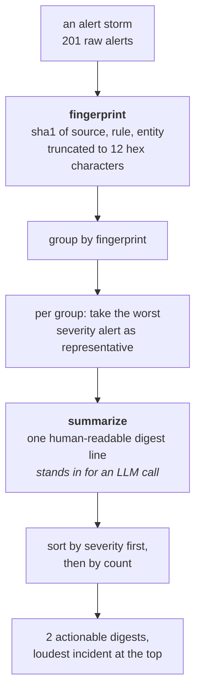
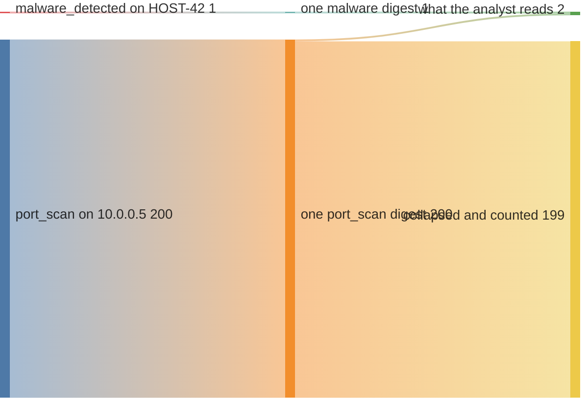

# ⚙️ Automation

<div align="center">

**One module for grouping repeated alerts into ranked digests.**


</div>

Repeated alerts can make triage harder. This example groups alerts by source,
rule, and entity, then ranks the resulting digests by severity and volume.

[`alert_deduper.py`](alert_deduper.py) produces one digest per grouping key.
The synthetic example below reduces two hundred related alerts to one digest.

> [!IMPORTANT]
> **Operational savings have not been measured.** Removing an hour of analyst
> triage per day is a hypothetical benefit, not a result. The output below
> measures grouping behavior on synthetic inputs.

## The defect behind each module

One module, so one row. It is here for the same reason the other twenty three
are: a naive version of it exists, reads correctly, and does not work.

| # | The job | How the naive version failed | What runs now | File |
| --- | --- | --- | --- | --- |
| 1 | Collapse an alert storm into one digest per incident. | Keying the group on the whole alert, message and timestamp included. No two rows are byte-identical, so a storm of two hundred stays a storm of two hundred and the deduper is a no-op that reports as coverage. | The key is **source, rule and entity** only. Severity picks the group's representative and sorts the output, and never splits a group. The count is kept on every digest rather than discarded. | [`alert_deduper.py`](alert_deduper.py) |

## How they fit together



The interesting decision is not the grouping, it is **what the key leaves out**.

| In the fingerprint | Deliberately out of it | Why |
| --- | --- | --- |
| `source` | the free-text `message` | A storm is the same rule firing on the same entity from the same source, even when every message differs slightly. Key on the message and a storm of two hundred stays a storm of two hundred. |
| `rule` | timestamps | Same reason. Byte-identical is the wrong definition of "the same incident". |
| `entity` | severity | Severity is used to pick the group's representative and to sort, never to split a group. Two severities on one incident is still one incident. |

## What is here

| File | The idea in one line | |
| --- | --- | --- |
| [`alert_deduper.py`](alert_deduper.py) | Collapse a storm on **what the key leaves out**, then rank by severity before volume. | [read](#alert_deduperpy) |

---

## `alert_deduper.py`

**Two hundred and one rows become two, and the one that matters is on top.**

```bash
python3 automation/alert_deduper.py
```

A synthetic storm: 200 near-identical firewall alerts on one address, plus one
genuine endpoint detection.

```text
201 raw alerts -> 2 actionable digests
  sev4 x  1  [malware_detected] fired 1x on HOST-42. Likely one root cause. Sample: 'Trojan.Generic quarantined'
  sev2 x200  [port_scan] fired 200x on 10.0.0.5. Likely one root cause. Sample: 'scan burst #0'
```

Where the two hundred and one rows actually go:



**Derivation.** Every figure is from the run above. Two hundred alerts share a
fingerprint and collapse to one digest, so 199 of them never reach a person as
separate rows; the count `x200` is what survives of them, and it survives on
purpose. One alert has its own fingerprint and stays its own digest. The
analyst's page is two rows.

The ordering is the second half of the value. The single severity-4 detection
sits **above** the two hundred severity-2 alerts, because the sort is severity
first and volume second. A deduper that ranked by count would bury the one alert
that mattered underneath the storm it was competing with, which is the same
problem in a new costume.

The `count` is kept on every digest rather than discarded. A storm of 200 and a
storm of 2 are different operational facts even when they collapse to the same
line, and an on-call engineer needs to see which one they are looking at. That
is the four-states discipline from
[`honest_states.py`](../polymind/honest_states.py) applied to a count: the
number that was thrown away is exactly the number somebody will want.

## Measured

`alert_deduper.py` is 68 source lines and carries **29 tests**, the smallest
count in the repository and the highest ratio of tests to lines outside
[`polymind/`](../polymind/). The module is 29 of the suite's 1,514.

**Derivation.** The test count is the `Ran N tests` line from
`python3 -m unittest tests.test_alert_deduper`. The source count is the
non-blank, non-comment lines in the file (`grep -cvE '^[[:space:]]*($|#)'`). The
full per-module plot is on the [front page](../README.md).

The tests are mostly not about the hashing. They are about the boundaries the
section below describes: that a group is not split by severity, that the
representative is the worst alert rather than the first, that the count survives
onto the digest, and that the sort is severity before volume. The arithmetic is
the easy part and it is not where this module can be wrong.

Non-vacuity is checked by planting a one-line mutation in a scratch copy of the
tree and confirming the suite turns red. **Four mutations on this module, every
one caught, 17 test deaths**, reproducible with `python3
tests/mutation_harness.py --module automation/alert_deduper.py`. One of them,
`AD4`, narrows the fingerprint from 12 hex characters to 8. The tests detect
this contract change. The harness is described in
[`../tests/README.md`](../tests/README.md).

## Scope and limits

An engineer reading this should know where the edges are, so here they are.

> [!WARNING]
> **The fingerprint is a grouping key, not a security digest.** It is a SHA-1
> hash truncated to 12 hex characters, chosen for readability in a console.
> A collision can merge unrelated groups. Production use should retain the
> full grouping tuple or check it before merging, and security decisions should
> not rely on this truncated digest.

- **There is no time window.** `dedupe()` groups whatever list it is handed,
  end to end. The same rule firing on the same entity in January and in June
  collapses into one digest. A production deployment wants a rolling window,
  and that window is a policy decision rather than a detail.
- **The grouping key is a judgement call, and it can be wrong.** Two genuinely
  independent incidents that share a source, a rule and an entity will collapse
  into one. That is the intended trade, and it is the trade you should be
  able to defend before you deploy it.
- **`summarize()` is a stand-in for an LLM call**, deliberately deterministic
  so the module runs with no network, no key, and no clock. The real value of
  the LLM in this shape is writing the one-line digest and naming the likely
  root cause; the collapsing itself is arithmetic and should stay arithmetic,
  so grouping remains deterministic and independently testable.
- **The sample line is the worst alert's message**, and where several alerts
  tie on severity, Python's `max` returns the first of them. In the run above
  that is why the sample reads `scan burst #0` rather than `#199`.
- **No saving is claimed.** The hour-a-day figure in the callout at the top of
  this page is the shape of an argument, not a result, and no measurement of
  analyst time appears anywhere in this repository.

## Running it

Standard library only. No install step, no virtualenv, no network, no clock, no
unseeded randomness.

```bash
python3 automation/alert_deduper.py
```

The module is covered by [`../tests/test_alert_deduper.py`](../tests/test_alert_deduper.py),
and the conventions behind the suite are written up in
[`../tests/README.md`](../tests/README.md).

```bash
make test
```

*All examples use synthetic data. No secrets, tenants, hostnames, or real
alerts from any production environment are included.*

## The themes this directory carries

The five ideas that run through all four directories, and where this one sits in
each. The full cross-cut, with every instance file-linked, is
[`../docs/THEMES.md`](../docs/THEMES.md). Two of the five are **absent here**,
and saying so is the point of keeping the index honest.

| Theme | What this directory contributes |
| --- | --- |
| [1. A control written and not in effect](../docs/THEMES.md#1--a-control-that-is-written-and-not-in-effect) | Applied preventatively rather than as a defect. The fingerprint is named as a grouping key and not a security digest, and `summarize()` is named as a stand-in and not an LLM, so neither can be mistaken later for the thing it resembles. |
| [2. Fail closed](../docs/THEMES.md#2--fail-closed-as-a-discipline-rather-than-a-slogan) | **Absent, correctly.** `dedupe()` refuses nothing. It is a grouping function whose failure mode is a wrong grouping, not a wrong authorization, and it states which trade it is making instead of claiming a posture it does not have. |
| [3. Four states, never collapsed](../docs/THEMES.md#3--four-states-never-collapsed) | The `count` is kept on every digest. A storm of 200 and a storm of 2 are different operational facts even when they render as the same line. |
| [4. Method you may copy, measurement you may not](../docs/THEMES.md#4--a-method-you-may-copy-a-measurement-you-may-not) | The cost argument is a conditional and is published as one. The method of making the case may be copied; there is no measurement attached to it, and none is invented. |
| [5. An approval names one exact action](../docs/THEMES.md#5--an-approval-names-one-exact-action) | **Absent, correctly.** Nothing here authorizes anything, so there is no approval to bind. |

<div align="center">

[`../README.md`](../README.md) &nbsp;&middot;&nbsp;
[`polymind/`](../polymind/README.md) &nbsp;&middot;&nbsp;
[`ai_security/`](../ai_security/README.md) &nbsp;&middot;&nbsp;
[`blackgate/`](../blackgate/README.md) &nbsp;&middot;&nbsp;
[`../docs/THEMES.md`](../docs/THEMES.md) &nbsp;&middot;&nbsp;
[`tests/`](../tests/README.md)

</div>
