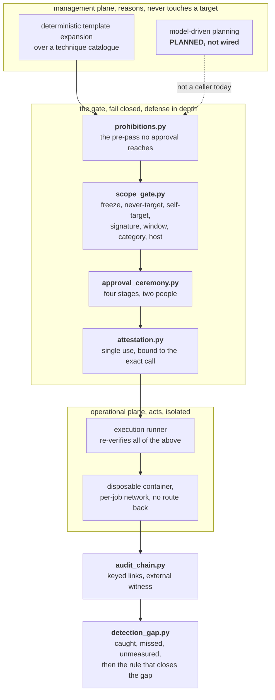
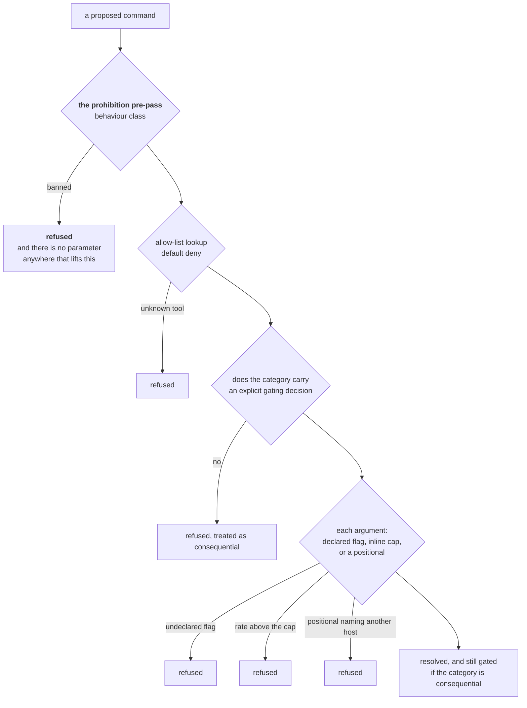
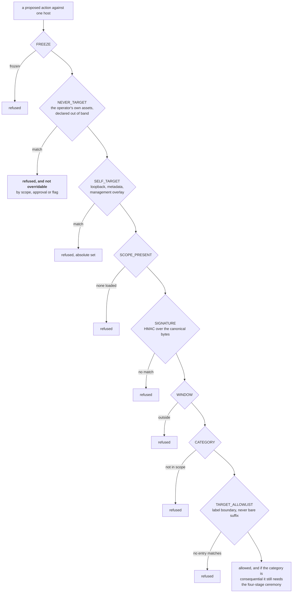
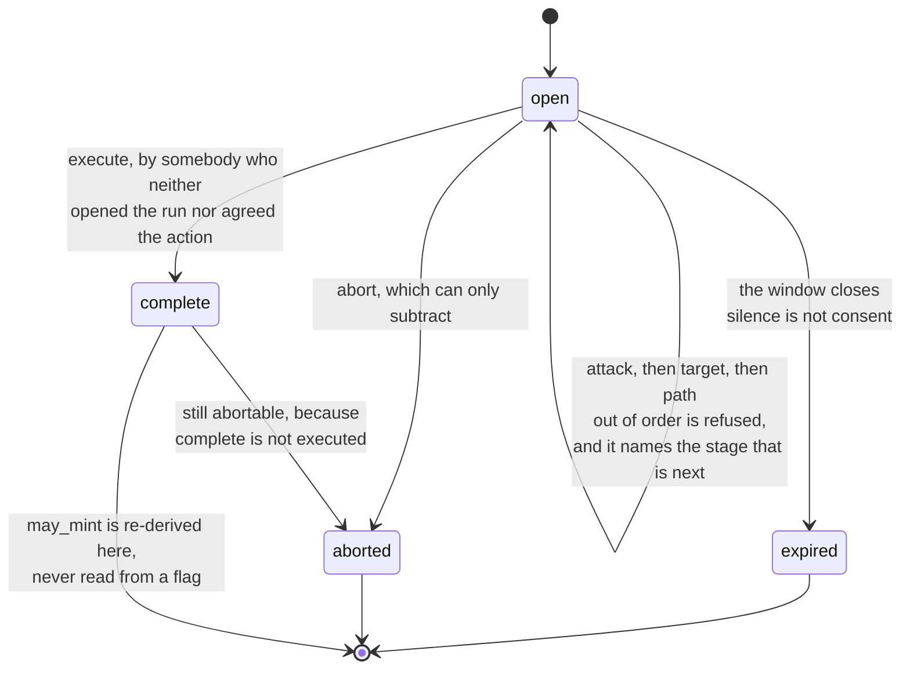
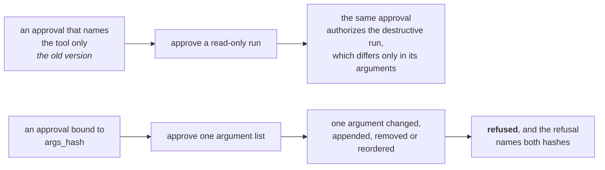
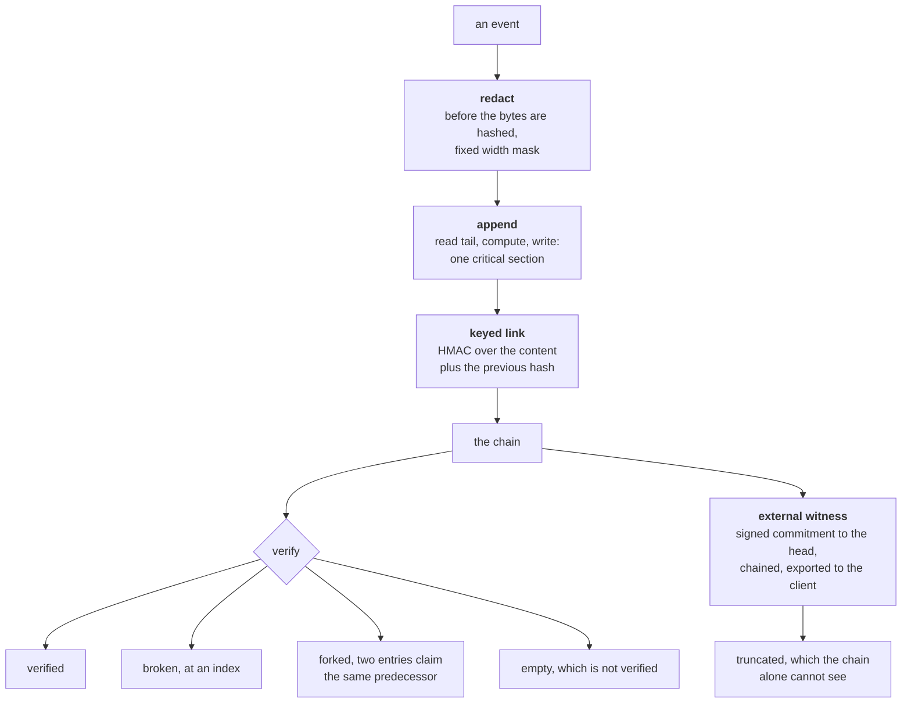
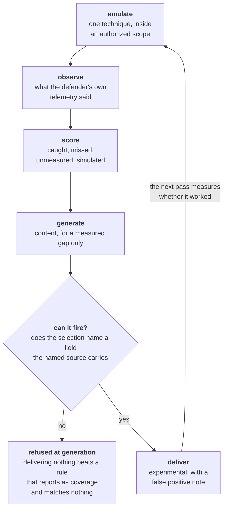
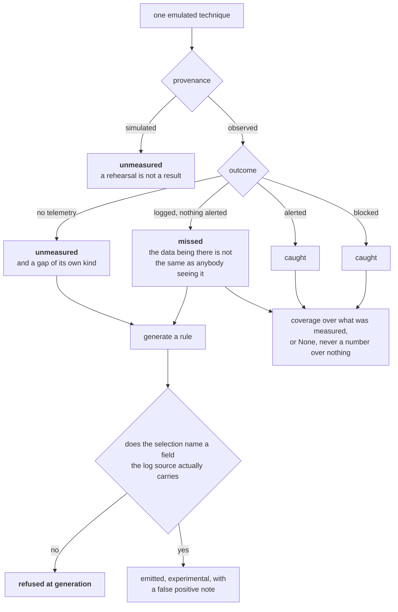
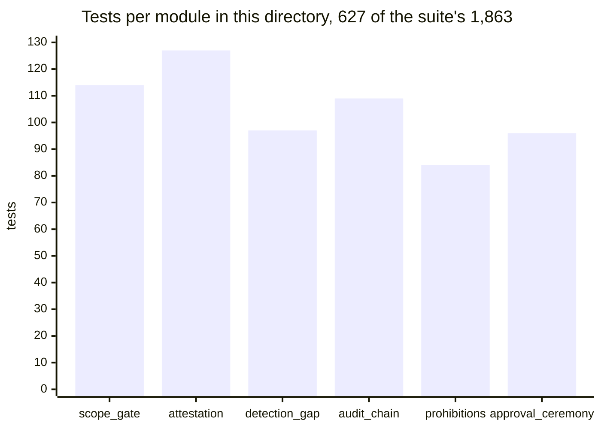
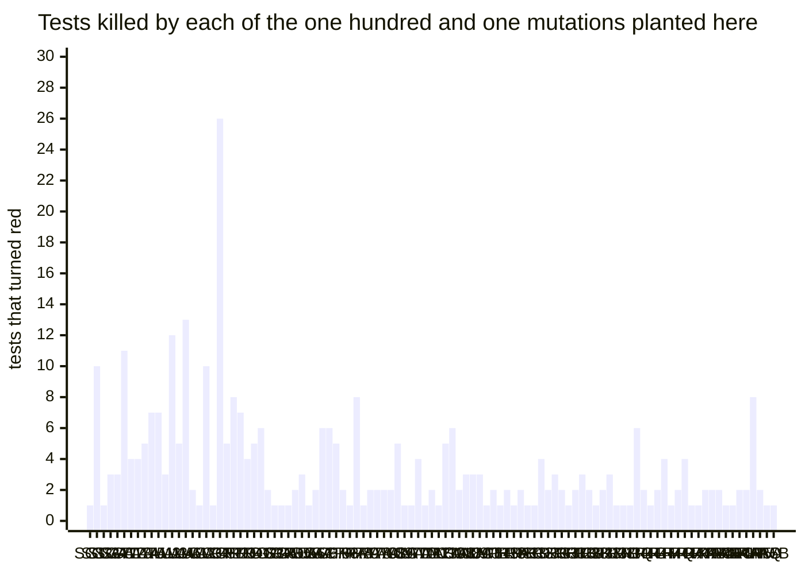

# 🔐 BlackGate

<div align="center">

**Authorized, human-gated adversary emulation and purple team.** Six Python modules demonstrating safety controls, with implementation status and limitations.


</div>

BlackGate is a private platform for **authorized, human-gated security
testing**. Its intended workflow is to test explicitly authorized assets,
measure detection and response coverage, and generate detection content for
review and retesting.

**The architectural design separates planning from execution.** It calls for isolated execution, ordered authorization gates, and a keyed audit record with an external witness. These standalone modules demonstrate selected controls; this repository does not implement or verify the private platform's deployment, network isolation, or end-to-end integration.

This page focuses on the **safety controls**: the prohibition nobody can lift, the gate, the
two humans, the approval bound to one exact command, the record, and the loop
that closes a detection gap. There is no offensive capability in this directory,
and there is none coming.

This directory is **not** that platform. It is six small modules that each
demonstrate one idea from its safety architecture, written from scratch, with no
third-party imports, and each runnable on its own. Six modules, **627 of the
repository's 1,863 tests**, and one real printed run per module that takes a
second to reproduce.

**If you read three things on this page, read these.**

| | | |
| --- | --- | --- |
| The control with the least give in it | [`prohibitions.py`](#prohibitionspy) | A ban that sits outside the precedence table entirely. `resolve()` has no approval parameter, no override and no force, so there is nowhere to put one. |
| The sharpest mechanism | [`attestation.py`](#attestationpy) | An approval carrying a hash of the exact ordered argument list, recomputed from the arguments about to run. An approval minted for one command cannot authorize another, and the refusal names both hashes. |
| Detection validation | [`detection_gap.py`](#detection_gappy) | Matching a technique identifier in command text does not establish detection of the technique. The example separates technique metadata from source-specific selection fields. |

> [!IMPORTANT]
> **Public implementation scope.** These examples do not include an autonomous model driver, production execution runner, egress infrastructure, graph-memory service, or witness scheduler. The architecture diagram describes intended integration; the public tests validate the standalone Python controls. Private-platform runtime status is not established by this repository.

---

## The register question, answered once

The examples demonstrate authorization decisions, approval binding, audit verification, and detection scoring. They do not establish autonomous operation or production readiness. The detection workflow requires a person to validate generated content and decide when to retest.

---

## The defect behind each module

Each module documents a failure mode and a corrective mechanism. The runnable fixtures make those mechanisms reviewable without publishing private operational records.

| # | The control | How the naive version failed | What runs now | File |
| --- | --- | --- | --- | --- |
| 1 | Some things nobody may authorize. | The ban was a rule in the same precedence table as everything else, with approval above it, so the **strongest credential** was a legal way to override an absolute prohibition. | A pre-pass that runs before the allow-list is consulted, in a function with no approval parameter, no override and no force. | [`prohibitions.py`](prohibitions.py) |
| 2 | A signed scope authorizes a host. | The self-target guard covered loopback and private ranges and said nothing about the operator's **own public assets**. One reaching a signed scope was authorized by every check downstream, correctly, because the signature was valid and the host was on the list. | A never-target backstop declared out of band, evaluated **before** the scope is read, not overridable by a scope, an approval, or a flag. | [`scope_gate.py`](scope_gate.py) |
| 3 | Four questions, asked in order. | Two people acknowledged the same stage at once. The stored decision was correct and atomic; the **answer handed to the loser** reported success and named the loser as the decider, so every downstream record carried the wrong author. | The result says whether this call is the one that changed anything, and always names whoever actually holds the stage. | [`approval_ceremony.py`](approval_ceremony.py) |
| 4 | A human approves a consequential action. | The approval named the **tool** and stopped there. Approving a read-only run of a tool silently approved the destructive run of the same tool, which differs only in its arguments. | A hash of the exact ordered argument list is bound into the signed payload and recomputed from the arguments actually about to run. | [`attestation.py`](attestation.py) |
| 5 | A tamper-evident record. | A plain hash chain is tamper evident only against someone who cannot recompute it, and a plain hash needs no key. Anyone with write access could edit an entry, repair every link after it, and hand you a chain that verified perfectly. | Keyed links, redaction before hashing, one critical section per append, and an **external witness** for the truncation a log cannot see in itself. | [`audit_chain.py`](audit_chain.py) |
| 6 | Generated detection content for every gap. | Every generated rule matched a **MITRE technique id inside a command line**, on one hardcoded log source. Such a match does not establish technique coverage; a syntactically valid rule may miss the behavior it claims to detect. | The technique id lives in the tags. The detection body is built from fields the named source carries, and a rule whose selection names none of them is refused at generation. | [`detection_gap.py`](detection_gap.py) |

> [!WARNING]
> Number six generalizes past detection content and is the most useful
> sentence on this page. **A control that cannot fire is not a lenient
> control, it is an absent one**, and it is worse than having nothing, because
> it occupies the slot a real one would go in and it reports as coverage.

---

## How they fit together

The two planes, and the gate stack between them. Solid lines are the request.
Everything in the middle can only subtract.



Two things that diagram is arguing for.

**The prohibition is outside the authorization chain, not at the top of it.**
Everything else in the middle answers "may this operator do this". The
prohibition answers "may anyone", and those are different questions with
different shapes. Putting them in one ordered table is how the second one
acquires an override.

**The design calls for independent verification at execution.** The public modules illustrate byte-stable framing and binding rules; they do not include the second-language execution runner or establish its behavior.

---

## What is here

The six sections below are in the order a request meets them, so the page reads
top to bottom the way the diagram above reads top to bottom: the question nobody
may answer, then the question of authority, then the two humans, then the
approval bound to one exact command, then the record, then the deliverable.

| | File | What it shows | The failure it exists for | |
| --- | --- | --- | --- | --- |
| **1** | [`prohibitions.py`](prohibitions.py) | A ban with nowhere to put an override, plus a default-deny allow-list and an argument parser that does not guess. | An absolute rule that the most privileged credential can lift | [read](#prohibitionspy) |
| **2** | [`scope_gate.py`](scope_gate.py) | Eight gates in a fixed order, each able only to refuse, each naming itself in the decision. | Testing something nobody authorized, including something the operator owns | [read](#scope_gatepy) |
| **3** | [`approval_ceremony.py`](approval_ceremony.py) | Four separate questions in order, two people, expiry, and a lost race that says so. | One click standing in for four judgements, and a record with the wrong author on it | [read](#approval_ceremonypy) |
| **4** | [`attestation.py`](attestation.py) | An approval that authorizes one exact command, once, bound to a hash of its exact ordered argument list. | An approval spent on a call it was never given for | [read](#attestationpy) |
| **5** | [`audit_chain.py`](audit_chain.py) | Keyed hash chain, redaction before hashing, fork detection, epoch cross-linking, external witness. | A record edited by the party with the most reason to edit it | [read](#audit_chainpy) |
| **6** | [`detection_gap.py`](detection_gap.py) | Caught, missed, unmeasured and simulated kept apart, and generated rule templates with structural field checks. | Remediation content that matched nothing, and a coverage number computed over no measurements | [read](#detection_gappy) |

---

## `prohibitions.py`

**Not everything a system refuses is a permission somebody senior enough can
grant.**

Most of a gated platform is a question of authority: who may do this, against
what, with whose sign-off. A small part of it is not. Denial of service cannot
be consented to by the one party whose consent would matter, which is everybody
else using the service. Anti-forensic behaviour destroys the audit record the
platform exists to produce, so a system that can be asked to hide its own
tracks has no output worth having. Neither is a permission. So neither is
modelled as one.



> [!IMPORTANT]
> **The ban was a rule in the same precedence table as everything else**, with
> approval above it, so an approval at a high enough level was a legal way to
> override an absolute prohibition. The table was correct in every ordinary
> case and the hole opened only for the holder of the strongest credential,
> which is the worst possible distribution. The fix is structural rather than a
> reordering. `resolve` takes one parameter, a request. There is no approval
> argument, no override, no force. The most reliable way to stop an override
> being added later is for there to be nowhere to put one.

**The ban also runs before the allow-list lookup, not after.** If it ran after,
adding a banned tool to the allow-list would quietly re-enable it, and the
allow-list is the file people edit. The registry in this module contains a
banned entry deliberately, so a test can show that its presence there changes
nothing.

**Two defaults pointed the wrong way.** Refusing only what is on a deny list
permits everything nobody has thought of, which is the larger set by a wide
margin. And a category reaching the gate without an explicit decision fell
through to "not consequential", so a newly added category shipped un-gated.
`registry_is_complete` is a function rather than a comment, so the check happens
when somebody adds a category rather than when somebody reads the file.

**The positional escape** is the subtlest of them. Argument validation assumed
the token after a flag was that flag's value. Most flags take one. A boolean
switch does not, so the token after it was a positional, and treating it as a
consumed value meant it skipped the destination check entirely: a host that was
never compared against the engagement target reached the command line. Only
flags a tool **declares** as value-taking consume the next token, which is why
`Tool.value_flags` is a separate field from `Tool.flags`.

<details>
<summary><b>The real run</b> &nbsp; <code>python3 blackgate/prohibitions.py</code></summary>

Neutral placeholder tool names throughout. The point is the shape of the rules.

```text
every registered category carries a gating decision: True

an allow-listed scan                   ALLOW  RESOLVED       port_probe resolved for shop.example.invalid
a gated tool, resolved                 ALLOW  RESOLVED       config_probe resolved for shop.example.invalid  ceremony required
a tool nobody registered               REFUSE ALLOWLIST      'mystery_tool' is not on the allow-list
a flag nobody declared                 REFUSE FLAG           '--dump-keys' is not a permitted flag for tls_audit
a rate above the cap                   REFUSE RATE_CAP       --rate 50000 is above the cap of 1000
a rate under the cap                   ALLOW  RESOLVED       port_probe resolved for shop.example.invalid
a second host after a boolean switch   REFUSE DESTINATION    'bank.example.invalid' names a destination other than the engagement host 'shop.example.invalid'
a value after a value flag             ALLOW  RESOLVED       dns_enum resolved for shop.example.invalid
the banned tool                        REFUSE PROHIBITION    packet_flood is in the denial_of_service class, which is banned unconditionally
```

Rows seven and eight are the positional escape and its opposite. Both are a
token that is not a flag. In row seven the flag before it is a boolean switch
that consumes nothing, so the token is a positional and faces the destination
check, and it names a host that is not the engagement host. In row eight the
flag before it declares that it takes a value, so the token is that value and
is not a destination at all. Under the old parser both were values and neither
was checked.

Rows five and six are the reason the ban is on the behaviour and not only on
the name. The tool is identical and allow-listed in both. One of them is a
denial of service wearing an approved label.

Then the part worth the page:

```text
the banned tool, presented with every approval anyone can hold:
  none                   REFUSE PROHIBITION    packet_flood is in the denial_of_service class, which is banned unconditionally
  operator               REFUSE PROHIBITION    packet_flood is in the denial_of_service class, which is banned unconditionally
  ceremony_complete      REFUSE PROHIBITION    packet_flood is in the denial_of_service class, which is banned unconditionally
  client_countersigned   REFUSE PROHIBITION    packet_flood is in the denial_of_service class, which is banned unconditionally
  emergency_override     REFUSE PROHIBITION    packet_flood is in the denial_of_service class, which is banned unconditionally
  root                   REFUSE PROHIBITION    packet_flood is in the denial_of_service class, which is banned unconditionally

the consequential tool, same levels:
  none                   REFUSE CEREMONY       consequential action with approval level 'none'
  operator               REFUSE CEREMONY       consequential action with approval level 'operator'
  ceremony_complete      ALLOW  RESOLVED       config_probe resolved for shop.example.invalid  ceremony required
```

Six identical lines are the entire argument. The approval level is read for the
second tool and changes the outcome, which is what an approval is for. For the
first tool it is not read at all, because the decision was made before the
approval was reached and nothing after that point can revisit it.

</details>

## `scope_gate.py`

**Past the prohibition, the question is still not whether the action is
sensible. It is whether this host is allowed to be a target at all.**

Eight gates, one fixed order, and the order is the property. A gate can only
refuse, so reading the list top to bottom is the entire authorization story,
and every decision names the gate that made it.



**The backstop is evaluated before the document it backs up.** That ordering is
the whole fix. The guard everybody writes refuses loopback and private ranges,
which protects the laptop and says nothing about the operator's own company
domain or public address block. Those live on ordinary routable addresses and
look exactly like a client asset. If one reaches a signed scope, by a typo or a
recursive discovery step, every check downstream agrees it is authorized,
because it is. So the never-target list is declared out of band, checked before
the scope is read, and there is no parameter anywhere that lifts it.

> [!NOTE]
> **Address normalization is directional, and getting it backwards opens one
> surface while closing the other.** The IPv4-mapped IPv6 form of an address
> parses as version 6. On the **deny** surface it must be folded to the address
> it embeds, or the mapped spelling slips past every version 4 entry the
> operator listed. On the **allow** surface it must **not** be folded, because a
> mapped literal should not be authorized by a version 4 entry that two
> independent parsers may not agree about. Same input, opposite correct
> answers, because one list is a floor and the other is a ceiling. Both
> directions are implemented and both are pinned by tests.

**Suffix matching is not domain matching.** `host.endswith(base)` is the line
everyone writes, and under an entry for `example.invalid` it authorizes
`notexample.invalid` too. Matching is on a label boundary. A `*.` entry is
subdomains only and deliberately does not match the apex, because "you may test
the subdomains" and "you may test the main site" are different sentences and a
scope should be able to say either one.

<details>
<summary><b>The real run</b> &nbsp; <code>python3 blackgate/scope_gate.py</code></summary>

A signed scope authorizing one documentation block, one apex and one
subdomains-only wildcard, evaluated at tick 150. The comments are in the source.

```text
ALLOW  TARGET_ALLOWLIST 198.51.100.20                      authorized by scope ENG-2026-014   # inside the authorized block
ALLOW  TARGET_ALLOWLIST shop.example.invalid               authorized by scope ENG-2026-014  ceremony required   # authorized, and consequential
ALLOW  TARGET_ALLOWLIST api.shop.example.invalid           authorized by scope ENG-2026-014   # subdomain of an authorized apex
ALLOW  TARGET_ALLOWLIST dev.lab.example.invalid            authorized by scope ENG-2026-014   # matches the subdomains only entry
REFUSE TARGET_ALLOWLIST lab.example.invalid                not in the authorized host list   # the apex of a subdomains only entry
REFUSE TARGET_ALLOWLIST notexample.invalid                 not in the authorized host list   # the bare endswith trap
REFUSE TARGET_ALLOWLIST shop.example.invalid.other.invalid not in the authorized host list   # the other endswith trap
REFUSE NEVER_TARGET     203.0.113.9                        operator owned asset, matched '203.0.113.0/24', not overridable   # operator owned, listed in version 4
REFUSE NEVER_TARGET     ::ffff:203.0.113.9                 operator owned asset, matched '203.0.113.0/24', not overridable   # the same address, version 6 spelling
REFUSE SELF_TARGET      169.254.169.254                    absolute blocked range 169.254.0.0/16   # cloud instance metadata
REFUSE CATEGORY         shop.example.invalid               category PERSISTENCE is not in the scope   # category not in the scope
REFUSE NEVER_TARGET     3232235781                         host could not be normalized, so it could not be screened   # an address wearing a hostname costume

the same call outside the window, and with the platform frozen:
REFUSE WINDOW           198.51.100.20                      outside the authorized window [100, 200]
REFUSE FREEZE           198.51.100.20                      the platform is frozen

one host appended to the list after signing:
REFUSE SIGNATURE        bank.example.invalid               scope signature did not verify
```

Four rows to read twice.

**Rows eight and nine are the same address.** One is written in version 4, one
in its version 6 mapped form, and the operator listed only the version 4 range.
Both are refused, which is the deny-surface fold. The allow surface does the
opposite, and the test suite pins that too: `::ffff:198.51.100.20` is **not**
authorized by the version 4 entry that authorizes `198.51.100.20`.

**Rows six and seven are the endswith traps**, the one that ends in the right
letters and the one that carries the authorized name as a prefix. Neither is a
host in the engagement and neither is authorized.

**Row twelve is an address wearing a hostname costume.** A bare run of digits
is a 32 bit address encoding. It is refused rather than guessed at, because a
value that is a hostname to one parser and an address to another is not
something to resolve by preference.

**The last line is the point of signing anything.** A host was appended to the
target list after the scope was signed. The gate does not refuse it for being
off-scope, it refuses the whole document, because the document is no longer the
one that was authorized.

</details>

## `approval_ceremony.py`

**Four questions, asked in order, answered by more than one person.**

One button gathers four separate judgements into a single click: whether the
action is right, whether the host is right, whether the route is acceptable,
and whether now is the moment. Those have different people best placed to
answer them, and collapsing them means the weakest of the four never gets asked.



> [!NOTE]
> **The response told the loser of the race that it had decided.** Two people
> acknowledging the same stage at once is ordinary, not adversarial. The stored
> decision was correct and atomic, because the write was conditional on the
> stage still being open. The answer handed back to whoever lost reported
> success and named the loser as the decider, and every record built from that
> answer then carried the wrong author. Here the result says whether this call
> is the one that changed anything, and always names whoever actually holds the
> stage.

Three more rules, each of which was once absent.

**Expiry is checked before the stage is**, so a late final acknowledgement
cannot complete a window that has already closed, and expiry is a state the
ceremony enters rather than a condition somebody remembers to test.

**Two-person control binds where it bites.** Whoever opened the run cannot
release it, and neither can whoever agreed the action at the first stage. Those
are the two roles an automated campaign tends to collapse into one session.

**The permission to mint is re-derived every time it is asked**, from the
recorded acknowledgements, never read from a flag set earlier. A flag set once
and trusted afterwards is the same shape of defect as an approval that names a
tool and not its arguments: the thing being checked quietly stops being the
thing that is true.

<details>
<summary><b>The real run</b> &nbsp; <code>python3 blackgate/approval_ceremony.py</code></summary>

One ceremony walked correctly, then one refusal per ceremony.

```text
APPLIED attack   open       Do you agree with the action and the tool?  held by operator-a
APPLIED target   open       Do you agree with the host?  held by operator-a
APPLIED path     open       Do you agree with the route it takes to get there?  held by operator-a
APPLIED execute  complete   Approve and run.  held by operator-b
  [x] attack   Do you agree with the action and the tool?         operator-a
  [x] target   Do you agree with the host?                        operator-a
  [x] path     Do you agree with the route it takes to get there? operator-a
  [x] execute  Approve and run.                                   operator-b
  may mint: (True, 'four stages acknowledged by 2 operators')

the refusals, one ceremony each
REFUSED execute  open       out of order, attack is next  # skipping to the end
REFUSED attack   open       acknowledgement carries no operator  # nobody signed it
REFUSED path     open       out of order, target is next  # out of order
REFUSED execute  open       two-person control: the operator who opened this cannot release it  held by operator-a  # one person, every stage
  may mint: (False, 'stages not acknowledged: execute')
REFUSED execute  expired    opened at 1000, ttl 100, now 1200  # nobody came back in time
  may mint: (False, 'ceremony expired before it completed')
```

The fourth refusal leaves three stages acknowledged and the ceremony open for a different operator. It remains subject to expiry and abort; it is not open indefinitely.

The fifth is the abandoned one. Nobody came back inside the window, so the
final acknowledgement is refused and the ceremony is `expired` rather than
still pending.

Then the race, and the abort:

```text
two operators acknowledge the same stage
  first : APPLIED attack   open       Do you agree with the action and the tool?  held by operator-a
  second: REFUSED attack   open       stage already acknowledged  held by operator-a
  the record says the stage is held by: operator-a

an aborted ceremony cannot be resumed
APPLIED -        aborted    client withdrew the window  held by operator-a
REFUSED target   aborted    ceremony is aborted
  may mint: (False, 'ceremony was aborted')
```

The second acknowledgement is refused and tells the caller, by name, who
actually holds the stage. Under the old behaviour that line would have read
`APPLIED ... held by operator-b`, the record would still have said
`operator-a`, and the two would have disagreed forever.

</details>

## `attestation.py`

**An approval that authorizes one exact command, once.**

A human approval is usually stored as a boolean, and a boolean is a bearer
token: it says yes without saying yes to what. So the approval here is a signed
statement naming the engagement, the host, the action category, the tool, the
operator, a nonce, when it was issued, and a hash of the exact ordered argument
list. Any one of those differing at execution time is a refusal.



> [!WARNING]
> **A delimiter join is not a canonical form.** Join the signed fields on a
> delimiter and the delimiter becomes part of the data, so a value containing
> it moves the field boundary and two different field tuples produce identical
> signed bytes. The same defect sat one level down, inside the argument hash,
> where a newline join made `["a\nb"]` and `["a", "b"]` hash identically.
> Length-prefixed framing fixes both: each field is emitted as its byte length,
> a colon, then its bytes, and the length is metadata the data cannot forge.

Three smaller rules that are easy to get backwards.

**The nonce is consumed last**, after every other check has passed, so a
refusal never burns an approval that a human walked four stages to produce.

**The spent-nonce store has to survive a restart.** Single use held perfectly
until the process restarted, at which point every approval still inside its
freshness window was spendable again, and a restart is not an unusual event, it
is a deployment.

**One key does not do every job.** The same secret signing the scope, the
approval and the audit chain means a signature minted in one context is a
candidate MAC in another, and one leak is a total loss rather than a partial
one. Each role derives its own subkey.

<details>
<summary><b>The real run</b> &nbsp; <code>python3 blackgate/attestation.py</code></summary>

One attestation, minted for one exact command, then presented against a series
of calls that are almost it.

```text
the approved arguments, first use              PASS    bound to this exact call, first use
the approved arguments, second use             REFUSE  nonce already spent, this is a replay

one argument changed                           REFUSE  arguments differ from the approved ones (approved d4536d0593e9, presented 1271716afdad)
one argument appended                          REFUSE  arguments differ from the approved ones (approved d4536d0593e9, presented c67dd4ae2cd5)
a different host                               REFUSE  bound to a different host
presented by a different operator              REFUSE  bound to a different operator
presented 400 ticks later                      REFUSE  stale, issued 400 ticks ago and the limit is 300
operator key only, client key required         REFUSE  client countersignature did not verify
```

Rows one and two are the single-use property in two lines. Rows three and four
are the defect this file exists for: the tool is right, the operator is right,
the engagement is right, and one argument is different.

Row six is a defect that was found on this page rather than in the field.
`operator_id` was bound into the signed payload from the first version of the
file, so the signature covered it and the record named a person, and `verify`
compared every other signed field to the real request and skipped that one. An
attestation minted for one operator verified for any other. A signed field
nobody compares is worse than an absent one, because the record shows a name
and invites the reader to believe it was checked, and in a module whose whole
argument is that an approval names one exact action it is the same family of
defect as the approval that named a tool and not its arguments. `operator_id`
is now a required positional argument of `verify`, so a caller cannot drop the
check by omission.

The last row is dual control. The attestation was countersigned with the
operator's own key rather than the client's, which is exactly what a leak of
the operator key alone lets somebody do, and it is refused because the client
key is held by the client.

Then the three properties underneath, measured rather than asserted:

```text
role separation: the same bytes under three roles
  scope        f593eb7b5db956dff8e69918e8ad003c
  attestation  17881012e51ceca72d7ea59e92ba9097
  audit        a1d52a7214208634b1d711a5839846c1

the framing collision, shown both ways
  joined form produces identical bytes : True
    'ENG-1|shop.example.invalid|RECON'
    'ENG-1|shop.example.invalid|RECON'
  framed form produces identical bytes : False
  args ['a\nb'] and ['a','b'] hash the same : False

what a restart does to a nonce store
  first use on the live store            : True
  replay against the live store          : False
  replay after a restart with no journal : True
  replay after a restart from the journal: False
```

The middle block is the collision, printed rather than described. Those two
identical strings are the joined form of **two different field tuples**: one
where the engagement id is `ENG-1|shop.example.invalid` and the target is
`RECON`, one where the engagement id is `ENG-1` and the target is
`shop.example.invalid`. A signature over either verifies the other. Under
length-prefixed framing they are different bytes.

The last block is the restart. The third line is the defect and the fourth is
the fix, and the only difference between them is whether the store was handed
back the journal it wrote.

</details>

## `audit_chain.py`

**A record of what happened that is worth something to somebody who was not
there.**

The chain records events and a signed witness commits to its head. Verification can compare the chain with that commitment. External witness retention, key custody, and production storage are integration responsibilities, as noted in the [scope discussion](#the-register-question-answered-once).

An append-only log is the usual answer and it is not sufficient on its own,
because the party most able to edit it is the party with the most reason to.
Five properties make it hold up, and each of them is here because its absence
was a finding.



> [!WARNING]
> **A plain hash chain is not tamper evident.** It is tamper evident only
> against someone who cannot recompute it, and a plain hash needs no key.
> Anyone who can write the file can edit an entry, recompute every link after
> it, and hand you a chain that verifies perfectly. Keying the links with a
> secret that is not in the file turns "you would have to be careful" into "you
> would have to have the key".

**Redaction has exactly one correct moment.** Redact at render time and the
secret sits inside the hashed bytes permanently, which makes the audit trail
the most durable copy of the credential in the system. Redact afterwards and
the bytes change, so every link from that point breaks and the trail you were
protecting is now the one that fails verification. It has to happen in the
append path, before hashing, which is where it is. The mask is fixed width for
a related reason: retaining the first and last characters of a short or
structured secret would disclose a meaningful fraction of it.

**Append is one critical section, not three.** Two writers that both read the
tail before either writes produce two entries claiming the same predecessor,
and after a fork "the record" is two records. `verify` reports a fork as its own
state, because a fork and an edit have different causes and different fixes.
Ordinary appends use an in-process lock; verification and witness issuance use
a coherent snapshot. Callers must not mutate `entries` or `key` directly during
these operations, and must quiesce writers before epoch rotation. A persistent
or multiprocess adapter must supply its own transaction boundary.

**A log cannot detect the loss of its own newest records.** Truncate the tail
and what remains verifies perfectly, since every link still present is still
correct. No property of a self-contained append-only structure closes that. The
answer is external: a small signed commitment to the head, chained to the one
before it, exported to the client so a copy exists the operator cannot reach.

**Rotation is where whole epochs go missing**, so a new epoch opens with a
prologue naming the seal hash of the one it follows. There is no delete
anywhere in the file, which is a deliberate absence rather than an omission.

<details>
<summary><b>The real run</b> &nbsp; <code>python3 blackgate/audit_chain.py</code></summary>

A four entry chain, then five attacks on it.

```text
a four entry chain
  verify                     : verified  4 entries
  the secret in entry 3      : api_token=<redacted> used for the probe

someone with write access flips the refusal at index 1 to 'allowed'
and recomputes every link after it, holding no key:
  plain hash chain           : verified  4 entries
  keyed chain, same edit     : broken    4 entries  at index 1  entry hash does not match its content

two appenders that both read the tail before either writes
  verify                     : forked    3 entries  at index 2  two entries claim the same predecessor

truncation, which the chain alone cannot see
  witness at count           : 4, terminal 29505c10158b725b
  truncated chain verify     : verified  2 entries
  truncated against witness  : truncated 2 entries  chain is shorter than the witnessed count 4
  full chain against witness : verified  4 entries

epoch rotation, cross linked
  both epochs                : verified  7 entries
  second epoch with no prologue: broken    6 entries  at index 1  epoch 1 does not name the seal it follows
```

The edit in the second block is the one that matters in practice: an entry
recording that the gate **refused** something is flipped to say it allowed it,
and every link after it is repaired. On the plain chain the result verifies and
there is nothing to see. On the keyed chain it lands at index 1, which is the
entry that was edited.

The fourth block is the one that cannot be fixed from inside. `truncated chain
verify: verified` is not a bug in the verifier. The two entries that remain are
genuinely, correctly linked. Only the witness, which committed to a count of
four, knows that there were ever more than two.

</details>

## `detection_gap.py`

**The emulation is the easy half. The deliverable is whether anybody saw it.**

The input is a list of techniques and what the defender's telemetry said. The
output is a scorecard and experimental rule content for further validation. A generated rule is not evidence that the detection gap is closed.
No offensive capability appears anywhere in the file.

**This is the loop the deliverable closes**, and it is one of exactly two
feedback loops on this page. Emulate, observe what the defender's own telemetry
said, score, generate content for a measured gap, refuse to emit content that
cannot fire, deliver, and a later pass measures whether the delivered content
actually fires. The quantity being regulated is the defender's coverage, not the
platform's own activity. **Closed-loop is earned for the engagement cycle and
not for anything autonomous**: nothing in this module runs itself, and the
decision to retest is a person's.



Under that loop sits the per-technique decision, where the four states are kept
apart:



> [!CAUTION]
> **Validate behavior as well as syntax.** Matching a technique identifier in command text does not establish detection of its behavior. This example places identifiers in metadata and checks selection fields against its source profiles. `_validate_can_fire` is a structural check, not proof that a generated rule detects the intended behavior.

**Rules were built by interpolating values into a format string**, so a
technique name carrying a newline did not land as a value, it landed as new
YAML lines, and whoever controlled that name controlled the emitted rule's
keys: its level, its condition, anything. Every interpolated value is now a
single-quoted scalar with whitespace collapsed and internal quotes doubled.

**A rehearsal is not a result.** The replay harness fabricates outcomes so the
loop can be exercised without touching a client environment, which is right,
and it means a scorecard from a rehearsal is indistinguishable from one from an
engagement unless provenance travels with every verdict. It does, a simulated
attempt counts as unmeasured, and the simulated count gets its own line.

**Coverage over zero measurements is not a number.** An empty denominator
produced a comfortable full score or an alarming zero depending on which way
the guard was written, and both are inventions.

<details>
<summary><b>The real run</b> &nbsp; <code>python3 blackgate/detection_gap.py</code></summary>

Five emulated techniques: one alerted, one blocked, one logged with nothing
firing, one with no telemetry at all, and one simulated.

```text
coverage: 67% of 3 measured   caught 2  missed 1  unmeasured 2  simulated 1
  command-and-control    not measured unmeasured 1
  credential-access      1/1          unmeasured 0
  discovery              0/1          unmeasured 0
  lateral-movement       not measured unmeasured 1
  reconnaissance         1/1          unmeasured 0
  GAP  T1087    Account discovery                  logged, nothing alerted
  GAP  T1071    Application layer protocol         no telemetry was collected
```

Five attempts, three measured. Two tactics read **not measured** rather than
zero, and the two gaps carry different reasons, because "we looked and nothing
fired" and "we never collected this" need different fixes from different teams.

The same five attempts with nothing ingested at all:

```text
coverage: not measured   caught 0  missed 0  unmeasured 5  simulated 1
```

Not zero percent. Zero percent is a statement about the defender, and the
truth here is a statement about the measurement.

A rule generated for the first gap:

```yaml
title: 'Detection gap: Account discovery'
id: 'blackgate-gap-2739b2f5415e6d99'
status: experimental
description: 'Generated from an emulated technique. Outcome: logged, nothing alerted. Tune before enabling.'
references:
    - 'https://attack.mitre.org/techniques/T1087/'
tags:
    - 'attack.discovery'
    - 'attack.t1087'
logsource:
    category: 'process_creation'
detection:
    selection:
        ParentImage|endswith: '\\services.exe'
        EventID: 4688
    condition: selection
falsepositives:
    - 'Software deployment and patch tooling'
level: high
```

The technique id appears twice, in the tags and in the references, and not once
in the detection body. The detection body names `ParentImage` and `EventID` from this example's source profile. Actual telemetry schemas vary, and the selection still needs validation against positive and negative events.

Then the injection attempt and the rule that cannot fire:

```text
a technique name carrying a newline and a quote
  title: 'Detection gap: Account discovery'' level: informational condition: never'
  id: 'blackgate-gap-2739b2f5415e6d99'
  emitted lines: 19 (a clean rule emits 19)

a rule whose selection names nothing the source carries
  RuleError: the selection names no field that dns carries, so the rule cannot fire: ['CommandLine']
```

The hostile name tried to add `level: informational` and `condition: never` as
keys. It came out as part of the title, with its quote doubled, and the rule is
the same nineteen lines as a clean one.

</details>

---

## Measured



**Derivation.** Each bar is the `Ran N tests` line from
`python3 -m unittest tests.test_<module>`, run on its own. The six sum to
**627**, and the four directories sum to the 1,863 the whole suite reports.

The six are unusually even, between 84 and 127, which is a consequence of the
subject rather than a target anybody aimed at. Each module is one gate with a
small number of ways to be wrong and a large number of ways to be
**deceptively** right, and the deceptive cases are what the tests are mostly
made of.

### The suite has been seen to fail, and you can watch it

A suite nobody has seen fail proves nothing. Every module here is checked by
copying the tree to a scratch directory, planting one exact one-line mutation in
the copy, and running the whole suite against it. The commands below reproduce
the reported mutation results.

```bash
python3 tests/mutation_harness.py --module blackgate/attestation.py
python3 tests/mutation_harness.py                 # all 229, about eighteen minutes
```

**One hundred and one (101) mutations across these six modules, every one caught,
338 test deaths.** The repository files are never edited: everything happens in the
scratch copy, and the harness ends by comparing a digest of every source file
taken before the run against one taken after.



**Derivation.** Each bar is the failures plus errors the suite reported with
that one mutation planted, read off the summary line of the run. The one hundred and one
sum to **338**. A run whose test count differs from the baseline is reported as
`broken` rather than counted, because a mutation that breaks an import makes the
suite fail to load rather than fail.

| id | Module | Mutation | Tests that turned red |
| --- | --- | --- | ---: |
| SG1 | `scope_gate.py` | host matching falls back to a bare suffix test | 1 |
| SG2 | `scope_gate.py` | the deny surface stops folding the mapped address form | 10 |
| SG3 | `scope_gate.py` | an empty target list authorizes everything | 1 |
| SG4 | `scope_gate.py` | a category outside the scope stops being refused | 3 |
| SG5 | `scope_gate.py` | the absolute deny list loses carrier-grade NAT space | 1 |
| SG6 | `scope_gate.py` | the deny surface stops folding the 6to4 spelling | 3 |
| AT1 | `attestation.py` | the approval stops binding the argument list | 11 |
| AT2 | `attestation.py` | framing reverts to a delimiter join | 4 |
| AT3 | `attestation.py` | the nonce is no longer single use | 4 |
| AT4 | `attestation.py` | the operator on the attestation stops being compared | 5 |
| AT5 | `attestation.py` | the argument hash stops framing each argument's type | 7 |
| AT6 | `attestation.py` | an argument list supplied as text is walked as the list of its characters | 5 |
| AU1 | `audit_chain.py` | the chain links stop being keyed | 7 |
| AU2 | `audit_chain.py` | a forked chain is no longer detected | 3 |
| AU3 | `audit_chain.py` | a detail field is hashed without being redacted | 12 |
| AU4 | `audit_chain.py` | a chain shorter than its witness stops being truncation | 5 |
| AU5 | `audit_chain.py` | the redaction list loses one of the words it covers | 3 |
| AU6 | `audit_chain.py` | a secret under a quoted field name reaches the hashed bytes | 13 |
| AC1 | `approval_ceremony.py` | stages can be acknowledged out of order | 2 |
| AC2 | `approval_ceremony.py` | the operator who opened the run may release it | 1 |
| AC3 | `approval_ceremony.py` | an expired ceremony can still be completed | 10 |
| AC4 | `approval_ceremony.py` | minting stops requiring two distinct operators | 1 |
| AC5 | `approval_ceremony.py` | an operator identity stops folding the blank-width characters | 26 |
| AC6 | `approval_ceremony.py` | a tick before the ceremony opened reads as inside its window | 6 |
| AC7 | `approval_ceremony.py` | a tick that is not a time reads as inside the window | 6 |
| PR1 | `prohibitions.py` | the unconditional ban stops running | 5 |
| PR2 | `prohibitions.py` | every flag consumes the token after it again | 8 |
| PR3 | `prohibitions.py` | the rate cap stops being enforced | 7 |
| PR4 | `prohibitions.py` | a flag the tool does not declare is accepted | 4 |
| PR5 | `prohibitions.py` | one declared rate cap is raised by a factor of a thousand | 1 |
| PR6 | `prohibitions.py` | an argument list supplied as text is walked into its characters | 2 |
| DG1 | `detection_gap.py` | coverage over nothing becomes a full score | 5 |
| DG2 | `detection_gap.py` | a simulated verdict counts as a result | 6 |
| DG3 | `detection_gap.py` | an interpolated value stops being collapsed and quoted | 2 |
| DG4 | `detection_gap.py` | a rate that rounds onto 100 percent with a miss outstanding prints 100 | 1 |
| DG5 | `detection_gap.py` | a log source profile loses one of the fields it declares | 2 |
| DG6 | `detection_gap.py` | the rule id goes back to a joined pre-image | 1 |
| DG7 | `detection_gap.py` | the framing reverts to a delimiter join | 2 |
| PR7 | `prohibitions.py` | a walked buffer is one argument, whichever buffer type it arrives as | 1 |
| PR8 | `prohibitions.py` | an argument that is not text has not been checked | 8 |
| PR9 | `prohibitions.py` | an argument list refusing in any currency is an unchecked one | 1 |
| AT7 | `attestation.py` | every buffer spelling frames under the marker, not as its own bytes | 2 |
| AT8 | `attestation.py` | an argument list that cannot be walked is a digest, never a raise | 2 |
| AT9 | `attestation.py` | a digest field outside ASCII is unequal, never an exception | 2 |
| AC8 | `approval_ceremony.py` | a tick that refuses comparison is a window that could not be evaluated | 2 |
| AC9 | `approval_ceremony.py` | may_mint refuses a tick that refuses comparison rather than raising | 5 |
| AU7 | `audit_chain.py` | the audit signing key is not in the repr a log line reaches for | 1 |
| SG7 | `scope_gate.py` | the scope signing key is not in the repr a refusal reason reaches for | 1 |
| AT10 | `attestation.py` | an argument list that empties as it is read cannot be bound | 4 |
| AT11 | `attestation.py` | a framed argument is rendered inside a bound the caller does not set | 1 |
| AT12 | `attestation.py` | a digest that is not about the arguments is refused, not compared | 2 |
| AT13 | `attestation.py` | a freshness window that cannot be evaluated is a Verdict, not a raise | 1 |
| AC10 | `approval_ceremony.py` | an acknowledgement at a tick that refuses comparison is a refusal | 5 |
| AC11 | `approval_ceremony.py` | may_mint at a tick that refuses comparison is a refusal | 6 |
| SG8 | `scope_gate.py` | a window that cannot be evaluated is a Decision, not an exception | 2 |
| AU8 | `audit_chain.py` | a PEM private key block never reaches the bytes that are hashed | 3 |
| AU9 | `audit_chain.py` | an authorization header never reaches the bytes that are hashed | 3 |
| AU10 | `audit_chain.py` | a bare bearer credential never reaches the bytes that are hashed | 3 |
| DG8 | `detection_gap.py` | an interpolated field is rendered inside a bound this file sets | 1 |
| AT14 | `attestation.py` | a nonce is spent by its text, not by the object that presented it | 2 |
| AT15 | `attestation.py` | a presented nonce is a str and not a subclass that answers for one | 1 |
| PB10 | `prohibitions.py` | the argument that is checked is the argument that will be used | 2 |
| R3A | `attestation.py` | the text that is checked is the text that is hashed | 1 |
| R3B | `attestation.py` | a nonce is spent by its characters, not by what it says it is | 2 |
| R3C | `attestation.py` | a nonce that cannot be recorded is not spent either | 1 |
| R3D | `attestation.py` | verify hands back the arguments it checked | 1 |
| R3E | `detection_gap.py` | a scorecard row is keyed on the text of a tactic, not on the attempt | 4 |
| R3F | `detection_gap.py` | a rendering is an exact string, so nothing renders twice | 2 |
| R3G | `audit_chain.py` | an unterminated key marker does not erase the rest of a record | 3 |
| R3H | `audit_chain.py` | a private key block is recognised whatever case it is written in | 2 |
| R3I | `audit_chain.py` | an ordinary word that ends in a secret name is not a secret name | 1 |
| R3J | `audit_chain.py` | a chain owns the list of entries it appends to | 2 |
| R3K | `audit_chain.py` | a seal counts itself | 1 |
| R3L | `audit_chain.py` | an epoch sequence that starts mid-history is not verified | 2 |
| R3M | `scope_gate.py` | the signature commits to the fields the gate enforces | 3 |
| R3N | `scope_gate.py` | the boundary between the two signed lists is in the signed bytes | 1 |
| R3O | `scope_gate.py` | the window refusal is a refusal whatever the bounds are written as | 1 |
| R3P | `scope_gate.py` | a backstop that could not be read is not an empty backstop | 1 |
| R3Q | `approval_ceremony.py` | a window that cannot be evaluated has its own answer | 6 |
| R3I2 | `audit_chain.py` | a compound secret name written as one word is still a secret name | 2 |
| R3I3 | `audit_chain.py` | an authorization header carries a credential whatever its scheme is called | 3 |
| R4F | `audit_chain.py` | every caller supplied field is redacted before it is hashed | 2 |
| R4G | `audit_chain.py` | a prologue that names two seals names no single parent | 1 |
| R4H | `audit_chain.py` | the successor check compares the named seal rather than searching for it | 2 |
| R4M | `detection_gap.py` | one unrenderable gap field does not take the whole scorecard | 4 |
| R4P | `attestation.py` | one signed approval is spent once however many callers present it at once | 1 |
| R4Q | `attestation.py` | a journal row this store cannot unpack is a refusal and not a traceback | 2 |
| R4V | `attestation.py` | a journal this store cannot append to is refused at the door, not mid-verification | 4 |
| R4X | `audit_chain.py` | everything that can refuse happens before the seal is written | 1 |
| R4Y | `detection_gap.py` | a scorecard renders through the same reading it keys on | 1 |
| R4AB | `attestation.py` | an argument is bounded by what framing would visit, not only by how deep it nests | 2 |
| R4AC | `detection_gap.py` | a rule field is bounded by what rendering would visit, not only by how deep it nests | 2 |
| R4AE | `audit_chain.py` | no caller supplied code runs inside the append critical section | 2 |
| R4AF | `scope_gate.py` | the scope that verifies is the scope that decides | 1 |
| R4AG | `approval_ceremony.py` | one stage is acknowledged once however many callers arrive | 1 |
| R4AH | `approval_ceremony.py` | an abort is not overwritten by the acknowledgement it landed in | 2 |
| R4AI | `approval_ceremony.py` | the tick that is checked is the tick that is recorded | 2 |
| R4AM | `prohibitions.py` | the engagement host is read once, so every positional is compared to one host | 8 |
| R4AQ | `detection_gap.py` | a scorecard row is read once and not once per reading | 2 |
| R5A | `attestation.py` | an argument nobody can encode as ordinary UTF-8 is framed, not raised over | 1 |
| R5B | `audit_chain.py` | a caller field nobody can encode as ordinary UTF-8 is sealed, not raised over | 1 |

**Read the short bars, not the tall ones.** A mutation that kills twenty six
tests, `AC5`, is a property so central that it is hard to break without the
suite noticing. The bars sitting at **1** are the thin margins: exactly one test stands
between that property and a clean run, and if that test were ever deleted or
loosened the mutation would survive in silence.

`AC2` checks the two-person rule when the opener holds no other stage.
`PR5`, `AU5`, and `DG5` exercise the rate cap, redaction keys, and source-field
contract using independent expected values. `AT4` checks that the presenting
operator matches the identity bound into the attestation.

## Framework mapping

Every identifier was checked against its publishing source, with the name and
edition it currently carries.

### MITRE ATT&CK

| ID | Name | Where |
| --- | --- | --- |
| `T1595` | Active Scanning | the activity [`scope_gate.py`](scope_gate.py) decides whether to permit, and against what |
| `T1078` | Valid Accounts | what a replayable approval becomes once it leaks, which is what [`attestation.py`](attestation.py) binds against |
| `T1070` | Indicator Removal | the behaviour [`audit_chain.py`](audit_chain.py) makes evident, and the anti-forensic class [`prohibitions.py`](prohibitions.py) refuses |
| `T1070.002` | Indicator Removal: Clear Linux or Mac System Logs | the truncation case the external witness exists for |
| `T1565.001` | Data Manipulation: Stored Data Manipulation | the edit-and-repair case the keyed links close |
| `T1498` | Network Denial of Service | named in [`prohibitions.py`](prohibitions.py) as a banned behaviour class, not implemented |
| `T1499` | Endpoint Denial of Service | the same |
| ATT&CK as a vocabulary | | [`detection_gap.py`](detection_gap.py) organizes the whole scorecard by tactic and technique id |

### OWASP Top 10 for LLM Applications

| Control | 2026 | 2025 |
| --- | --- | --- |
| [`scope_gate.py`](scope_gate.py), [`prohibitions.py`](prohibitions.py) | LLM03:2026 Excessive Agency | LLM06:2025 Excessive Agency |
| [`attestation.py`](attestation.py), [`approval_ceremony.py`](approval_ceremony.py) | LLM03:2026 Excessive Agency | LLM06:2025 Excessive Agency |

> [!NOTE]
> Only one slot is claimed, and it is claimed for the planner-facing case
> rather than for the platform generally: a planner that can name any host has
> unbounded agency until something refuses the name. Since the agentic core is
> **not wired**, that mapping describes the control that is waiting for it, not
> a control that is currently restraining a model. Saying so is the point of
> the mapping.

### NIST AI RMF 1.0

| Subcategory | The text, quoted rather than paraphrased | Where |
| --- | --- | --- |
| `MANAGE 2.4` | "Mechanisms are in place and applied, and responsibilities are assigned and understood, to supersede, disengage, or deactivate AI systems that demonstrate performance or outcomes inconsistent with intended use." | the freeze gate, the abort path, and the refusal to carry an expired ceremony forward |
| `GOVERN 1.1` | on legal and regulatory requirements being understood and managed | [`prohibitions.py`](prohibitions.py), which is the honest home for a rule that exists because some actions are not the operator's to authorize |
| `GOVERN 3.2` | on roles and responsibilities being clearly defined | the two-person split in [`approval_ceremony.py`](approval_ceremony.py) |
| `MEASURE 2.7` | "AI system security and resilience, as identified in the MAP function, are evaluated and documented." | the coverage scorecard in [`detection_gap.py`](detection_gap.py) |
| `MEASURE 2.13` | "Effectiveness of the employed TEVV metrics and processes in the MEASURE function are evaluated and documented." | the external witness, which measures whether the measurement is still intact, and the provenance rule that refuses to score a rehearsal |

### Mappings deliberately not claimed

Declining a mapping is a control in its own right. A framework mapping that is
a stretch costs the credibility of the ones that are not.

| What was considered | Where it would have gone | Why it was declined |
| --- | --- | --- |
| Any OWASP LLM slot | [`audit_chain.py`](audit_chain.py) | It is an integrity control over a log. There is no LLM in it, and the nearest slot would be a stretch. |
| Any MITRE technique | [`approval_ceremony.py`](approval_ceremony.py) | An approval ceremony is a governance control, not an adversary behaviour. No identifier describes it, and inventing a near-fit would look tidier on a slide and be wrong. |
| Any NIST AI RMF subcategory | the address-matching rules in [`scope_gate.py`](scope_gate.py) | Network authorization, not AI governance. |
| MITRE ATLAS, anywhere | all six files | ATLAS is the right taxonomy for attacks **on** AI systems. Nothing here defends a model, so nothing here has an ATLAS mapping, and the neighbouring [`ai_security/`](../ai_security/README.md) directory is where those mappings honestly belong. |

---

## Running them

Standard library only. No install step, no network, no clock, no unseeded
randomness. Every time value in these files is an integer tick supplied by the
caller, which is why the tests are deterministic and why nothing here can drift
with the wall clock.

```bash
python3 blackgate/scope_gate.py
python3 blackgate/attestation.py
python3 blackgate/approval_ceremony.py
python3 blackgate/prohibitions.py
python3 blackgate/audit_chain.py
python3 blackgate/detection_gap.py
```

Every module has a test file under [`../tests`](../tests), and the suite is the
documentation: the test names are sentences stating the property under test.

```bash
make test
```

---

*Everything here is synthetic. RFC 5737 documentation addresses, `.invalid`
names, neutral placeholder tool names, and integer ticks. No credential, key,
token, internal hostname, client, engagement or operator identity from any real
system appears, and nothing in this directory is offensive tooling: every file
refuses, binds, records, or scores.*

See also [`../SECURITY.md`](../SECURITY.md) for how to report a vulnerability
in this repository, and [`../GOVERNANCE.md`](../GOVERNANCE.md) for the rules
this repository holds itself to. A guard here that can be bypassed, a
prohibition that can be overridden, or a generated rule that cannot fire is the
single most useful report this page can receive.

## The themes this directory carries

The five ideas that run through all four directories, and where this one sits in
each. The full cross-cut, with every instance file-linked, is
[`../docs/THEMES.md`](../docs/THEMES.md).

| Theme | What this directory contributes |
| --- | --- |
| [1. A control written and not in effect](../docs/THEMES.md#1--a-control-that-is-written-and-not-in-effect) | Five catalogued instances, including rules that did not establish their claimed coverage and the absolute ban that the strongest credential could legally lift. |
| [2. Fail closed](../docs/THEMES.md#2--fail-closed-as-a-discipline-rather-than-a-slogan) | **The home of this theme.** [`scope_gate.py`](scope_gate.py) is eight gates that can only refuse, in a fixed order, each naming itself in the decision. |
| [3. Four states, never collapsed](../docs/THEMES.md#3--four-states-never-collapsed) | `caught`, `missed`, `unmeasured` and `simulated` in [`detection_gap.py`](detection_gap.py), and five distinct verify states in [`audit_chain.py`](audit_chain.py), where a fork and an edit have different causes and different fixes. |
| [4. Method you may copy, measurement you may not](../docs/THEMES.md#4--a-method-you-may-copy-a-measurement-you-may-not) | A rehearsal is not a result, so provenance travels with every verdict. And a log cannot certify its own completeness, so the witness is external. |
| [5. An approval names one exact action](../docs/THEMES.md#5--an-approval-names-one-exact-action) | **The home of this theme.** [`attestation.py`](attestation.py) binds the exact ordered argument list, [`approval_ceremony.py`](approval_ceremony.py) splits one click into four judgements and two people, and [`prohibitions.py`](prohibitions.py) has nowhere to put an override at all. |

<div align="center">

[`../README.md`](../README.md) &nbsp;&middot;&nbsp;
[`polymind/`](../polymind/README.md) &nbsp;&middot;&nbsp;
[`ai_security/`](../ai_security/README.md) &nbsp;&middot;&nbsp;
[`automation/`](../automation/README.md) &nbsp;&middot;&nbsp;
[`../docs/THEMES.md`](../docs/THEMES.md) &nbsp;&middot;&nbsp;
[`tests/`](../tests/README.md)

</div>
