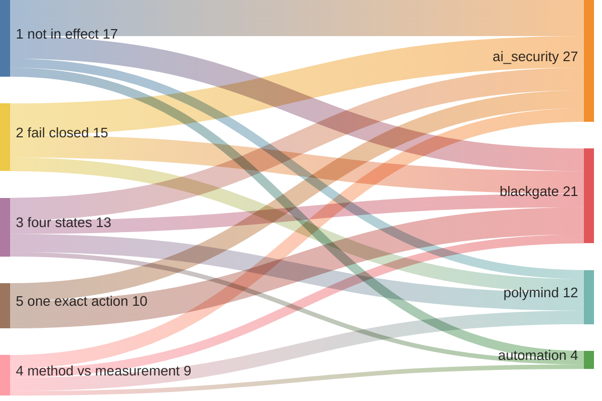
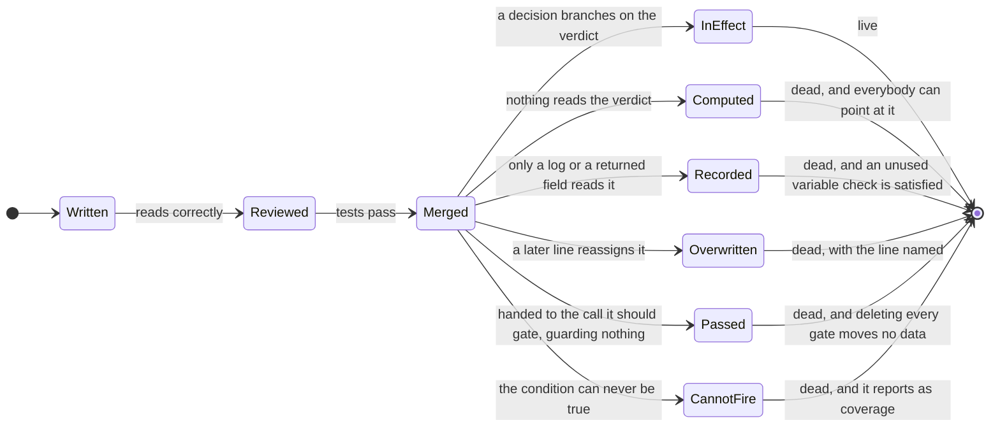
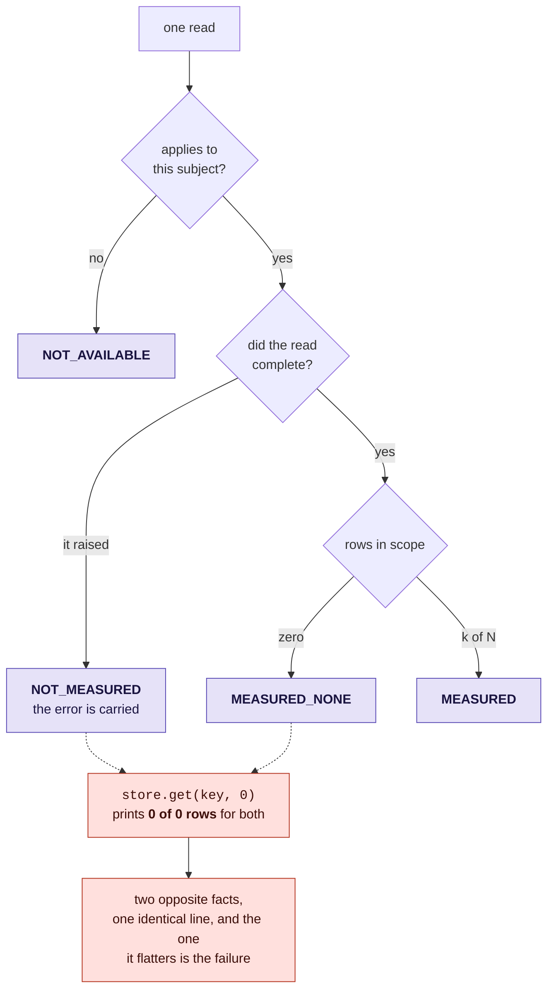
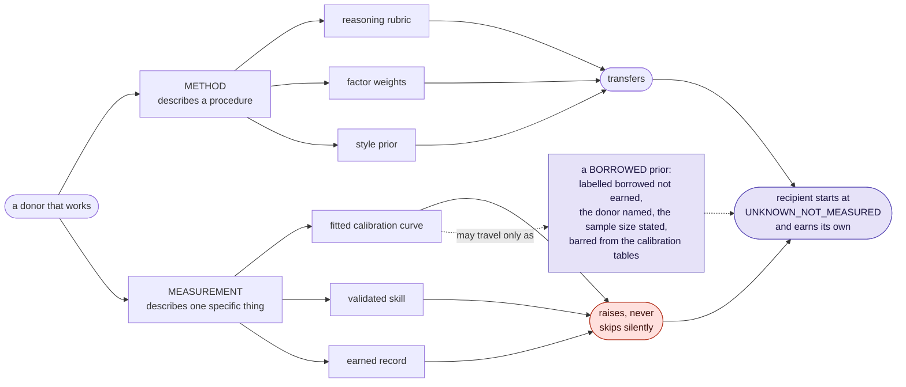
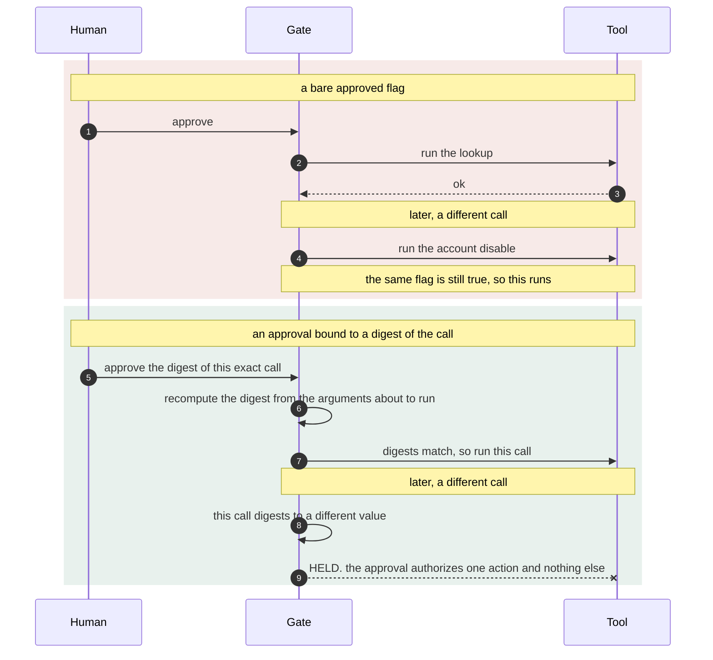

# 🧵 &nbsp; Five ideas, and every place they are in the code

**The way in by theme rather than by project.**

This index connects five engineering principles across the four projects.
Each section links the design decision to its implementation and tests, so
readers can compare how the same principle applies in different contexts.
The tables also identify where a principle is outside a project's scope.

| | Theme | The idea in one line | Where it is strongest |
| --- | --- | --- | --- |
| 1 | [A control that is written and not in effect](#1--a-control-that-is-written-and-not-in-effect) | The code says the right thing and the right thing is not what runs. Nothing errors. | [`control_flow_audit.py`](../ai_security/control_flow_audit.py) |
| 2 | [Fail closed, as a discipline rather than a slogan](#2--fail-closed-as-a-discipline-rather-than-a-slogan) | Every path that cannot decide ends in a refusal, including the paths nobody thought about. | BlackGate's [`scope_gate.py`](../blackgate/scope_gate.py) |
| 3 | [Four states, never collapsed](#3--four-states-never-collapsed) | *Not measured* is not *measured and found nothing*, and a default argument renders both as a reassuring zero. | [`honest_states.py`](../polymind/honest_states.py) |
| 4 | [A method you may copy, a measurement you may not](#4--a-method-you-may-copy-a-measurement-you-may-not) | A procedure is portable. A number earned by one specific thing is not, and copying it destroys the only test of whether the copy worked. | [`method_graft.py`](../polymind/method_graft.py) |
| 5 | [An approval names one exact action](#5--an-approval-names-one-exact-action) | A bare yes is a bearer token. It says yes without saying yes to what. | BlackGate's [`attestation.py`](../blackgate/attestation.py) |

## How the five distribute

Each link below is **the number of file-linked instances named in the tables on
this page**. It is a count of the evidence assembled here, not a census of the
code, and it is included because the shape of the distribution is the argument:
no theme lives in one directory, and two of the five are genuinely absent from
one.

**BlackGate, in [`blackgate/`](../blackgate/README.md), carries six of the ten
instances of theme 5 named on this page**, which is what you would expect from a
platform whose whole premise is that a named person authorized this exact action,
against this exact host, inside this exact window.

Theme 2 and theme 5 do not reach [`automation/`](../automation/), and theme 5
does not reach [`polymind/`](../polymind/). Those absences are correct. A
deduper refuses nothing, so it has no fail-closed posture to describe, and
neither a deduper nor a research platform's scoring path has a human approval
to bind. Those distinctions keep the coverage claims specific.

---

## 1 &nbsp;·&nbsp; A control that is written and not in effect

> [!IMPORTANT]
> This is the finding that reorganised the whole repository. The most useful
> defects found reviewing this code were **not wrong controls**. They were
> controls that were present, reviewed, merged, and **not in the decision
> path**. None of them errored. They require review of the decision path, not only the existence of a check.

A control fails this way in one of a small number of mechanical shapes, which is
what makes the class findable rather than merely regrettable.

The last state is the worst one. A control that cannot fire is not a lenient
control, it is an **absent** one, and it is worse than having nothing, because
it occupies the slot a real control would go in and it reports as coverage.

### Every instance in this repository

| Where | What the code said | What actually ran |
| --- | --- | --- |
| [`agentic_soc.py`](../ai_security/agentic_soc.py) | A reviewer agent was called and its verdict was written into the response. | `auto_execute` was computed from alert severity alone. The verdict was never read. |
| [`llm_output_validator.py`](../ai_security/llm_output_validator.py) | `requires_human=True` was returned to the caller. | Nothing honored it. A control that lives only in a returned field is one forgotten `if` away from not existing. |
| [`eval_harness.py`](../ai_security/eval_harness.py) | The release gated on safety and injection. | An agent refusing every request scores 1.0 on both. An empty bucket also scored 1.0, so a suite that had lost its safety cases reported perfect safety. |
| [`mount_audit.py`](../ai_security/mount_audit.py) | Every route of the main API carried an auth dependency. | A second router, added later, was mounted without it. The gap was not in any route, it was in the line that mounted them. |
| [`mount_audit.py`](../ai_security/mount_audit.py) again | A route declared an auth dependency. | A dependency-override map left in place at runtime replaced the real check with one that always says yes. The route still declares the control. |
| [`oauth_consent_grant.kql`](../ai_security/detections/oauth_consent_grant.kql) | `AdminConsent = OperationName has "admin"`. | No operation name the query filters on contains the word, so the column an analyst triages on was false on every row, forever. |
| [`anomalous_signin.kql`](../ai_security/detections/anomalous_signin.kql) | A home-country exclusion list, to cut noise. | The exclusion fires only when **both** countries are on the list, and the filter above already requires them to differ. A one-entry list could never exclude anything. |
| [`provenance_algebra.py`](../ai_security/provenance_algebra.py) | Trust is the meet of the input labels. | The identity element of a meet is the **top**, so a `reduce` over zero spans handed back full trust for a context nobody sourced. |
| [`detection_gap.py`](../blackgate/detection_gap.py) | A generated detection rule closes every measured gap. | Every rule matched a MITRE technique id **inside a command line**. A technique id never appears in a command line. Every rule generated, reviewed, delivered and counted as remediation matched zero events, forever. |
| [`prohibitions.py`](../blackgate/prohibitions.py) | Some behaviour classes are banned unconditionally. | The ban was a rule in the same precedence table as everything else, with approval above it, so the **strongest credential** was a legal way to lift an absolute prohibition. |
| [`scope_gate.py`](../blackgate/scope_gate.py) | A self-target guard stops the platform testing itself. | It covered loopback and private ranges and said nothing about the operator's **own public assets**, which sit on ordinary routable addresses and look exactly like a client asset. |
| [`attestation.py`](../blackgate/attestation.py) | An approval is single use. | It held perfectly until the process restarted, at which point every approval still inside its freshness window was spendable again. A restart is not an unusual event, it is a deployment. |
| [`approval_ceremony.py`](../blackgate/approval_ceremony.py) | Four stages must be acknowledged before a run may be released. | Permission to release was read from a flag set earlier rather than re-derived from the acknowledgements, so the thing being checked quietly stopped being the thing that was true. |
| [`evidence_gate.py`](../polymind/evidence_gate.py) | A provider that does not answer leaves a clearly marked placeholder. | A downstream consumer can count marked placeholders as observed outcomes unless it applies the evidence gate. |
| [`honest_states.py`](../polymind/honest_states.py) | A dashboard reports how many problems were found. | `store.get(key, 0)` renders a failed read as `0 problems found`: the most reassuring output the screen can produce, for the worst thing that can happen to it. |
| [`alert_deduper.py`](../automation/alert_deduper.py) | A fingerprint identifies an incident. | It is a truncated SHA-1 grouping key and **not** a security digest, and the page says so, so that nothing security-relevant is ever keyed on it by someone who assumed otherwise. |
| [`alert_deduper.py`](../automation/alert_deduper.py) again | The digest line names the likely root cause. | `summarize()` is a deterministic stand-in for an LLM call, labelled as one, so a placeholder is never mistaken for the capability it stands in for. |

### The analyzer

The class is mechanical, so it can be found mechanically.
[`control_flow_audit.py`](../ai_security/control_flow_audit.py) parses the
source, locates where a control verdict is computed, and asks whether that value
reaches the decision it is supposed to govern. It is worth building rather than
leaving to a linter because **a linter is clean on the exact bug**: the reviewer
agent's verdict *was* used, it was written into the response dictionary, and an
unused-variable check has nothing to say about that.

The state it exists for is the fifth one above. `runner(decision.tool, args)`
reads the verdict, so a data-flow-only pass reports the gate as connected.
Delete every guard clause in front of that call and the data flow is identical.
A gate influences a decision by being **control-dependent** on it, and implicit
flows are exactly what most taint tools drop on purpose. Here the implicit flow
is the control.

Four tests in
[`test_control_flow_audit.py`](../tests/test_control_flow_audit.py) run the
analyzer against this directory's own shipped modules, so a change that
reintroduces the shape surfaces there rather than in a review.

### What the worked examples demonstrate

Contrasting guarded and unguarded examples makes a control's effect on a
decision visible. The regression tests assert the required behavior independently
of the implementation. See [`tests/README.md`](../tests/README.md) for the
validation method and its limits.

---

## 2 &nbsp;·&nbsp; Fail closed, as a discipline rather than a slogan

Everyone writes "fail closed" in a design document. The discipline is in the
paths nobody thought about: the unreadable input, the unparseable answer, the
empty set, the missing parameter, the category somebody added last week. Each of
those has a default arm, and the default arm is where the posture is actually
decided.

The test is not whether the happy path refuses. It is what the code does when
it **cannot tell**.

| Where | The thing it cannot decide about | What it does |
| --- | --- | --- |
| [`prompt_guard.py`](../ai_security/prompt_guard.py) | Input whose provenance is unknown, or that is not a string at all | Blocked. Anything that cannot be screened has not been screened. |
| [`llm_output_validator.py`](../ai_security/llm_output_validator.py) | An unknown tool, an argument that fails its bound, a smuggled key, a validator that raises | All four end in the same place, which is refusal. Default deny is the only rule underneath it. |
| [`mount_audit.py`](../ai_security/mount_audit.py) | A route whose methods cannot be read; whose dependencies cannot be read; an empty auth-dependency set | Treated as mutating; treated as uncovered; covers nothing, because a rule that names no control cannot certify one. |
| [`agentic_soc.py`](../ai_security/agentic_soc.py) | A reviewer answer that cannot be parsed | A rejection. Silence is not consent. |
| [`provenance_algebra.py`](../ai_security/provenance_algebra.py) | The composition of zero spans | The bottom of the lattice, refused for **every** capability including the one with no trust floor. |
| [`differential_consistency.py`](../ai_security/differential_consistency.py) | Renderings that disagree; too few effective renderings to measure | Held for a human, never resolved by majority. Below the floor returns *not measured*, which does not permit the decision. |
| [`capability_attenuation.py`](../ai_security/capability_attenuation.py) | A confidence value that is missing or unparseable | Zero blast radius, not full. |
| [`scope_gate.py`](../blackgate/scope_gate.py) | Eight gates in a fixed order | Each can only refuse, and each names itself in the decision, so reading the list top to bottom is the entire authorization story. |
| [`prohibitions.py`](../blackgate/prohibitions.py) | A category reaching the gate with no explicit gating decision | Treated as consequential. `registry_is_complete` is a function rather than a comment, so the check happens when somebody adds a category, not when somebody reads the file. |
| [`approval_ceremony.py`](../blackgate/approval_ceremony.py) | A window that closed with nobody coming back | Expiry is a state the ceremony enters, checked before the stage is, so a late acknowledgement cannot complete a closed window. |
| [`detection_gap.py`](../blackgate/detection_gap.py) | A generated rule whose selection names no field its log source carries | Refused at generation rather than delivered. |
| [`attestation.py`](../blackgate/attestation.py) | Any one of engagement, host, category, tool, operator, nonce, freshness or argument hash differing at execution time | Refusal, and the nonce is consumed **last**, so a refusal never burns an approval a human walked four stages to produce. |
| [`posterior.py`](../polymind/posterior.py) | A missing price-implied null | Refuses to score, rather than falling back to a majority-class baseline. The fallback is the bug. |
| [`method_graft.py`](../polymind/method_graft.py) | A transfer request naming a measurement | Raises, rather than skipping silently, because a silent skip produces a plan that looks complete and quietly is not. |
| [`evidence_gate.py`](../polymind/evidence_gate.py) | A placeholder path that sets none of the three channels | Invisible to all three, so every count is declared a **lower bound** rather than implying a census the gate cannot deliver. |

**Measured.** Across the worked example each module ships and prints, refusals
outnumber permits in every gate module in the repository. The derivation and the
numbers are in [Measured, not asserted](../README.md#--measured-not-asserted) on
the front page.

**Not in [`automation/`](../automation/).** `dedupe()` refuses nothing. It is a
grouping function, its failure mode is a wrong grouping rather than a wrong
authorization, and the page says which trade it is making instead of claiming a
posture it does not have.

---

## 3 &nbsp;·&nbsp; Four states, never collapsed

> [!TIP]
> If you read one idea from this repository, read this one. *Not measured*
> rendering as a clean zero is the most dangerous output an assurance dashboard
> can produce, and it is the defect underneath most of the work here.

Four different answers that almost every dashboard collapses into one number:

| State | What it is a statement about |
| --- | --- |
| **NOT_AVAILABLE** | the subject. This metric does not apply here. |
| **NOT_MEASURED** | the check. It did not run, and the error is carried. |
| **MEASURED_NONE** | the world. It ran, and found nothing. This is a result. |
| **MEASURED** | the world. It ran, and found k of N. |

Applicability is decided **before** the read is attempted, on purpose: "this
subject has no such metric" is a fact you already know, and it must not be
discovered as a read failure.

### The same distinction, in thirteen places

| Where | The states it refuses to merge |
| --- | --- |
| [`honest_states.py`](../polymind/honest_states.py) | The canonical four, with the naive renderer kept in the file so the difference is **visible rather than asserted**. |
| [`evidence_gate.py`](../polymind/evidence_gate.py) | `EARNED`, `UNEARNED`, `NO_ROWS`, and absent from the report entirely. A seat that has earned nothing is a different fact from a seat that does not exist. |
| [`posterior.py`](../polymind/posterior.py) | `NOT_MEASURED_ENOUGH` is never rendered as a zero. Twelve rows is not a measurement, whatever rate they carry. |
| [`adaptive_signal.py`](../polymind/adaptive_signal.py) | A decision that fails either floor returns `hold` **with the reason attached**, rather than as silence. |
| [`eval_harness.py`](../ai_security/eval_harness.py) | An empty bucket returns `None` and a gate over `None` fails by name as *not measured*. Absence of evidence is not a pass. |
| [`agentic_soc.py`](../ai_security/agentic_soc.py) | `NO ACTION NEEDED`, `HELD FOR HUMAN`, `REFUSED` and `AUTO EXECUTE`. The first two look identical on a dashboard that tracks only whether an action ran, and they are opposites. |
| [`provenance_algebra.py`](../ai_security/provenance_algebra.py) | *Nobody measured the provenance* is not *the provenance is untrusted*, and the empty composition names the first. |
| [`differential_consistency.py`](../ai_security/differential_consistency.py) | `STABLE`, `DIVERGENT`, `NOT MEASURED`. And a canary that does **not** survive is not evidence of anything, which the report says in the clean case rather than only in the dirty one. |
| [`mount_audit.py`](../ai_security/mount_audit.py) | `unguarded`, `guarded`, `exempt`, `read only`, counted separately, with every exemption used printed with its written reason. |
| [`detection_gap.py`](../blackgate/detection_gap.py) | `caught`, `missed`, `unmeasured`, `simulated`. With nothing ingested it reports `coverage: not measured`, not `0%`. Zero percent is a statement about the defender; the truth there is a statement about the measurement. |
| [`audit_chain.py`](../blackgate/audit_chain.py) | `verified`, `broken at an index`, `forked`, `empty`, `truncated`. A fork and an edit have different causes and different fixes, and an empty chain is not a verified one. |
| [`approval_ceremony.py`](../blackgate/approval_ceremony.py) | `open`, `expired`, `aborted`, `complete`. Three stages ticked and no second person is `open` forever, which is the correct end state: not approved, not refused, waiting. |
| [`alert_deduper.py`](../automation/alert_deduper.py) | The `count` is kept on every digest rather than discarded. A storm of 200 and a storm of 2 are different operational facts even when they collapse to the same line. |

**The general rule.** A measurement that does not carry its own status is not a
measurement. A learning-stage report can distinguish: *ran*, *gate off*, *throttled*,
*unavailable*, *scheduled but silent*, or *never scheduled*. The fifth exists
for one purpose, which is to surface a control everybody believes is running and
is not.

---

## 4 &nbsp;·&nbsp; A method you may copy, a measurement you may not

A rubric, a set of factor weights and a style prior are a **procedure**, so they
port. A fitted calibration curve, a validated skill and an earned record are
**measurements of one specific thing**, produced by its own prompt, temperature
and mix of inputs. Copying either is not a transfer, it is a forgery with a
plausible number on it.

The refusal is load-bearing rather than fastidious. Copy the curve along with
the method and the recipient begins life already claiming to be well calibrated,
so **nobody can ever tell whether the graft worked**. The measurement that would
answer the question is the one that was destroyed by copying it.

### The same line drawn elsewhere

| Where | The method, which travels | The measurement, which does not |
| --- | --- | --- |
| [`method_graft.py`](../polymind/method_graft.py) | Rubric, factor weight vector, opening style lens. | Fitted reliability curve, validated skill on a row, earned record. `UnearnedClaimError`, and the refusal is an item in the plan rather than a silent omission. |
| [`calibration.py`](../polymind/calibration.py) | The scoring rule itself, which is just arithmetic anyone may copy. | The weight. It is re-earned from verified results every window and floored at zero, so nothing inherits influence. |
| [`posterior.py`](../polymind/posterior.py) | The rule table, which is data: printable, diffable, and readable by somebody who does not read Python. | The null. It is the rate you would have got on **exactly those rows**, so it cannot be carried over from another book or replaced by the constant 0.50. |
| [`eval_harness.py`](../ai_security/eval_harness.py) | The four buckets and their gates, stated as data. | The score, tied by a **suite fingerprint** to the exact cases behind it, so a shrinking suite cannot quietly inflate a rate. |
| [`provenance_algebra.py`](../ai_security/provenance_algebra.py) | The lattice and the composition laws. | An endorsement. It carries who, why, and a digest of the exact text read, so deriving anything from the endorsed span breaks the digest and the lift does not travel. |
| [`capability_attenuation.py`](../ai_security/capability_attenuation.py) | Idempotent components. `{read}` given to three sub-agents is still `{read}`, so it may be copied to siblings. | Additive components. A budget of 100 given to three sub-agents is 300, so it must be **split**. Every link is a strict attenuation and the leaves still hold triple. |
| [`detection_gap.py`](../blackgate/detection_gap.py) | The replay harness, which exercises the loop without touching a client environment. | The verdict. A simulated attempt counts as `unmeasured` and gets its own line, because a rehearsal is not a result. |
| [`audit_chain.py`](../blackgate/audit_chain.py) | The chain construction, which anyone may reimplement. | The commitment to the head. A log cannot certify its own completeness, so the witness is **external**, signed, chained, and exported to the client. |
| [`alert_deduper.py`](../automation/alert_deduper.py) | The argument to leadership, stated as a conditional: *if* this removes an hour of triage a day it pays for itself many times over. | Any number attached to it. That is a case for building it, not a measurement of anything, and the page says so in those words. |

**The general rule.** Keep transferable procedures separate from measurements
earned by a particular model. The public transfer policy is implemented in
[`method_graft.py`](../polymind/method_graft.py).

---

## 5 &nbsp;·&nbsp; An approval names one exact action

A human approval is usually stored as a boolean, and a boolean is a **bearer
token**: it says yes without saying yes to what. Approve a read-only run once
and the same approval waves through the destructive run of the same tool, which
differs only in its arguments.

The digest is the whole SHA-256, 256 bits. The two real values are 64 hex
characters each, which is why they are named here rather than written out: they
are quoted in full, straight from `python3
ai_security/llm_output_validator.py`, in
[`ai_security/README.md`](../ai_security/README.md#llm_output_validatorpy),
along with the security rationale for using the full digest.

### Everywhere the binding appears

| Where | What the approval is bound to | The property that buys |
| --- | --- | --- |
| [`llm_output_validator.py`](../ai_security/llm_output_validator.py) | A SHA-256 digest of the exact tool and arguments, over a canonical JSON form with sorted keys. | The same canonical call produces the same digest; SHA-256 provides collision resistance, not a mathematical guarantee of uniqueness. `execute()` holds the gate **itself**, so the control is not one forgotten `if` away from not existing. |
| [`attestation.py`](../blackgate/attestation.py) | Engagement, host, action category, tool, operator, nonce, issue tick, and a hash of the exact ordered argument list. | One argument changed, appended, removed or reordered is a refusal, and the refusal names both hashes. |
| [`attestation.py`](../blackgate/attestation.py), framing | Length-prefixed bytes rather than a delimiter join. | A delimiter join makes the delimiter part of the data, so two different field tuples sign identical bytes. A newline join also makes `["a\nb"]` and `["a", "b"]` hash identically. |
| [`attestation.py`](../blackgate/attestation.py), roles | A per-role derived subkey. | One secret signing the scope, the approval and the audit chain means a signature minted in one context is a candidate MAC in another, and one leak is a total loss rather than a partial one. |
| [`approval_ceremony.py`](../blackgate/approval_ceremony.py) | Four separate questions, in order, and at least two people. | One click cannot stand in for four judgements. Whoever opened the run cannot release it, and neither can whoever agreed the action, because those are the two roles an automated campaign collapses into one session. |
| [`prohibitions.py`](../blackgate/prohibitions.py) | Nothing. That is the point. | `resolve()` takes one parameter, a request. No approval argument, no override, no force. The most reliable way to stop an override being added later is for there to be **nowhere to put one**. |
| [`scope_gate.py`](../blackgate/scope_gate.py) | An HMAC over the canonical bytes of the whole scope document. | A host appended after signing does not get refused for being off-scope. The **whole document** is refused, because it is no longer the one that was authorized. |
| [`provenance_algebra.py`](../ai_security/provenance_algebra.py) | A digest of the exact text a named human read, with their reason. | The endorsement does not outlive the text it covered. Derive anything from the span and the digest no longer matches. |
| [`capability_attenuation.py`](../ai_security/capability_attenuation.py) | The **resolved** target, not the name. | An authority bound to `latest-report` is bound to a name, and the name is resolved by a table untrusted context can influence. `exercise()` performs the resolution itself. |
| [`agent_tool_invocation.kql`](../ai_security/detections/agent_tool_invocation.kql) | The detection side of the same property. | If every mutating invocation carries the approval id of that exact call, an empty `ApprovalId` warrants investigation. Missing telemetry can also produce that result; it does not prove the gate was bypassed. |

**The shared design principle.** In each case, the component that **performs** the action also **holds**
the check, rather than returning a flag and trusting the caller. `execute()`
holds the approval gate, `exercise()` performs the resolution, and `resolve()`
has no parameter an override could arrive through. A control that depends on the
caller doing the steps in the right order is one refactor away from not
existing.

**Not in [`polymind/`](../polymind/) or [`automation/`](../automation/).**
Neither has a human approval in its path. The research platform's scoring
modules decide what counts as evidence, which is a different question from who
authorized an action, and the deduper authorizes nothing at all.

---

[`../README.md`](../README.md) &nbsp;&middot;&nbsp;
[`polymind/`](../polymind/README.md) &nbsp;&middot;&nbsp;
[`ai_security/`](../ai_security/README.md) &nbsp;&middot;&nbsp;
[`blackgate/`](../blackgate/README.md) &nbsp;&middot;&nbsp;
[`automation/`](../automation/README.md) &nbsp;&middot;&nbsp;
[`GOVERNANCE.md`](../GOVERNANCE.md)

