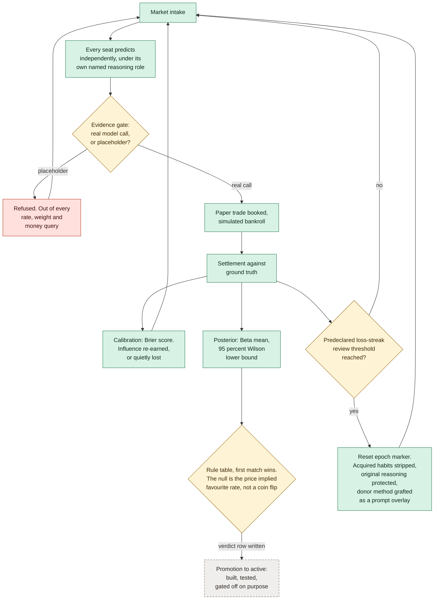

# The learning loop

One market, end to end, and every point at which the system is allowed to
refuse. This is a conceptual architecture, not a live deployment report.

**What it shows.** The loop closes four different ways, and three of them are
refusals: a row the evidence gate rejects, a verdict that never reaches a
promotion stage because that stage is switched off, and a losing streak that
resets a seat rather than letting it keep compounding. The dashed node is the
honest part. Measurement runs all the way round; the step that would let a
measurement change live behaviour does not.

**Checkable against.** `polymind/evidence_gate.py`, `polymind/posterior.py`
(`RULE_TABLE`, `price_implied_null`), `polymind/calibration.py`,
`polymind/method_graft.py`, The reset and promotion stages are conceptual; these public modules do not
implement the full loop.
