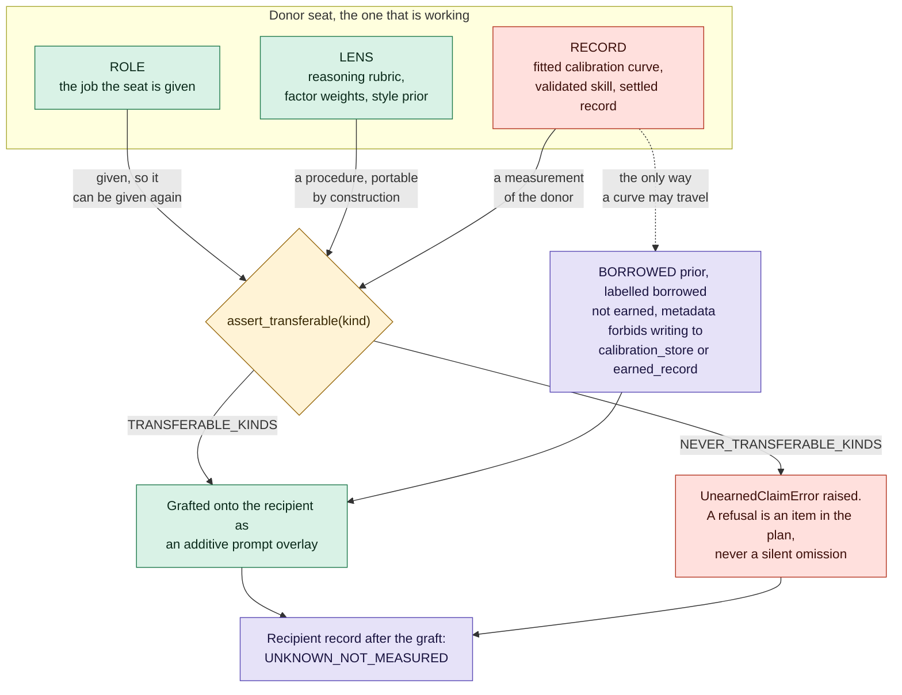

# Role, lens and record: what a graft may carry

Three things a model can hold. Two of them are a procedure and port cleanly.
The third is a measurement of one specific model and may never move.

**What it shows.** Why the refusal is the feature and not a limitation. A
grafted seat begins life unmeasured and has to earn its own curve, which is the
only condition under which anyone can later tell whether the graft worked. Copy
the curve as well and the recipient starts out already claiming to be well
calibrated, so the experiment can never fail. The refusal raises rather than
skipping, because a silent skip produces a plan that looks complete and
quietly is not.

**Checkable against.** `polymind/method_graft.py`: `TRANSFERABLE_KINDS`,
`NEVER_TRANSFERABLE_KINDS`, `assert_transferable`, `borrowed_prior`,
`UNMEASURED`, and `tests/test_method_graft.py`.

The borrowed-prior prohibition is metadata in this example. A consuming storage
layer must enforce it; the example does not implement such a layer.
