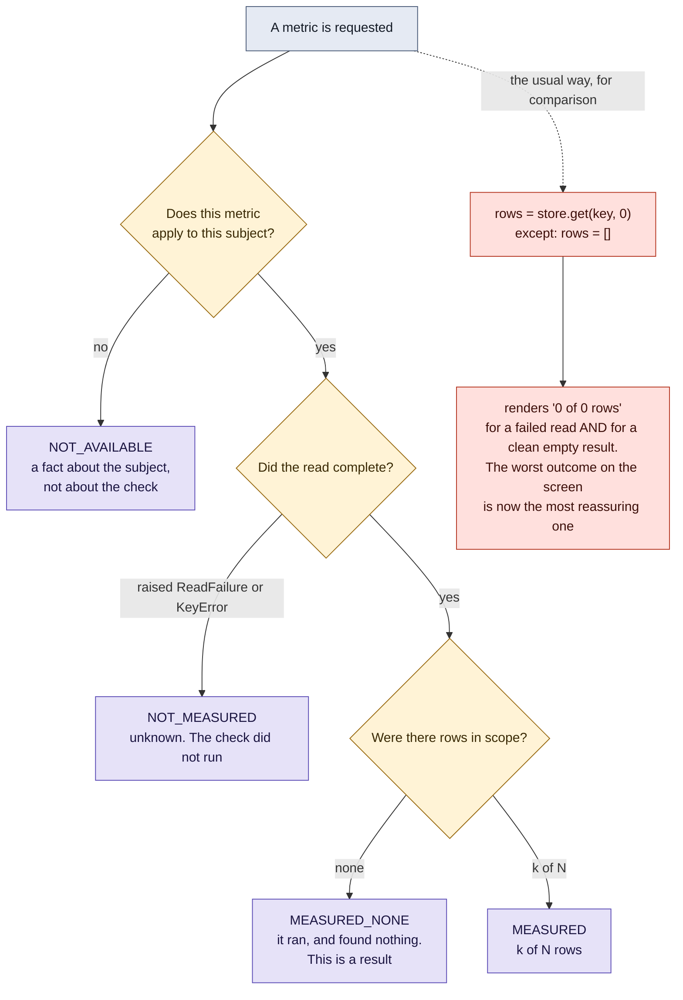

# The four honest states, and the default argument that lies

Four different answers that most dashboards collapse into one number. The
lower path is the defect, kept visible on purpose.

**What it shows.** The order is load bearing, and a flow diagram is the only
way to show that. Applicability is decided *before* the read is attempted,
because "this subject has no such metric" is something you already know and
must not discover as a read failure. Collapse any two of the four states and
you have re-invented the bug on the lower path.

**Checkable against.** `polymind/honest_states.py`: `State`, `read_state`,
`render`, and `render_naive`, which is the lower path kept in the file so the
difference is visible. Tests in `tests/test_honest_states.py`.
