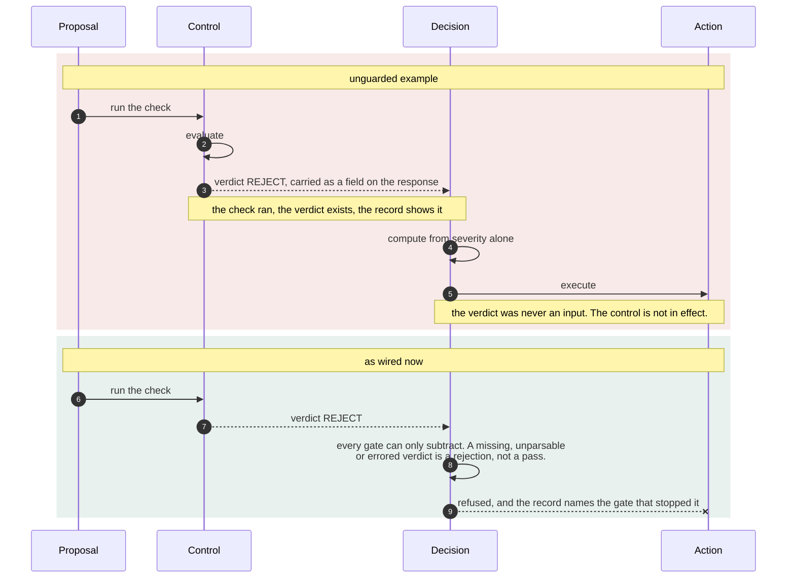

# A control that is written but not in effect

The check runs. The verdict is produced. The decision reads something else.
Nothing errors, and the control appears in the code, the response and the
architecture diagram.

**What it shows.** The shape, not one instance of it. Five separate defects
found in a single review pass of this repository were this same shape, and
none necessarily produces a runtime error:

| Where | The control that was written | Why it was not in effect |
| --- | --- | --- |
| `ai_security/agentic_soc.py` | a reviewer agent returning a verdict | `auto_execute` was computed from alert severity alone |
| `ai_security/llm_output_validator.py` | `requires_human=True` on the result | enforcement was left to the caller, one forgotten `if` from not existing |
| `ai_security/detections/oauth_consent_grant.kql` | an `AdminConsent` triage column | derived from `OperationName has "admin"`, and no filtered operation name contains it, so the column was false on every row forever |
| `ai_security/detections/anomalous_signin.kql` | a `HomeCountries` exclusion filter | it only fires when both countries are in the list, and the filter above it already requires them to differ, so a one entry list could never exclude anything |
| `ai_security/mount_audit.py` | a declared auth dependency on a route | a runtime dependency override map replaced it with a stub that always says yes |

A derived column that can only take one value is worse than a missing column,
because a missing column gets noticed.

**Checkable against.** The implementations named in the table and the regression test classes in
`tests/test_agentic_soc.py`, `tests/test_llm_output_validator.py`,
`tests/test_eval_harness.py` and `tests/test_prompt_guard.py`. Their assertions
exercise the required behavior at each decision boundary.
