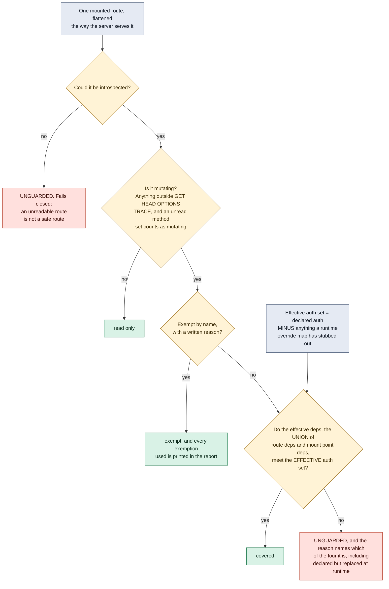

# The mount surface audit

Authorization is a property of the mounted surface, not of the file you are
reading. You cannot audit it from the route handlers, because the handler is
not where the coverage lives.

**What it shows.** The two things a route by route read cannot see. First, the
effective dependency set is the union of what the route declares and what the
mount point inherits, so a router added later and mounted without the
dependency leaves every route under it uncovered while each individual file
still looks correct. Second, the `OV` node: a dependency override map, the kind
a test suite installs to stub out authentication, left in place at runtime
replaces the real check with something that always says yes. The route still
declares the control. The control is no longer the thing that runs, so this
auditor only ever checks the effective control.

Every unknown fails closed. An empty auth dependency set means nothing is
covered, because a rule that names no control cannot certify one.

**The same surface, route by route.** This is the worked example
`python3 ai_security/mount_audit.py` prints. The right hand column is what
changes when a test override is left in place at runtime, and nothing else
about the application changes at all.

| Route | Methods | Mutating | Effective auth | Verdict | With `require_auth` stubbed at runtime |
| --- | --- | --- | --- | --- | --- |
| `/api/alerts` | GET | no | inherited at mount | read only | read only |
| `/api/alerts/{id}/close` | POST | yes | inherited at mount | covered | **UNGUARDED**, declared but replaced |
| `/api/models/reload` | POST | yes | inherited at mount | covered | **UNGUARDED**, declared but replaced |
| `/healthz` | GET | no | none | read only | read only |
| `/login` | POST | yes | none | exempt, reason printed | exempt, reason printed |
| `/api/reports/list` | GET | no | none | read only | read only |
| `/api/reports/refresh/run` | POST | yes | none | **UNGUARDED** | **UNGUARDED** |
| `/api/reports/purge` | DELETE | yes | none | **UNGUARDED** | **UNGUARDED** |
| unreadable mount | unknown | assumed yes | unreadable | **UNGUARDED** | **UNGUARDED** |

The `/api/reports/` rows are synthetic examples of a missing mount-level
authorization dependency. These paths are not a private endpoint inventory.

**Checkable against.** `ai_security/mount_audit.py`: `SAFE_METHODS`,
`Route.effective_dependencies`, `Route.is_mutating`, `audit_mount_surface` and
its `overrides` argument, plus the worked example under `__main__` which prints
the same surface twice, once clean and once with a test override left in place.
Mapped to MITRE ATT&CK T1190 and OWASP LLM03:2026 Excessive Agency
(LLM06:2025). The file deliberately claims no NIST AI RMF mapping.
