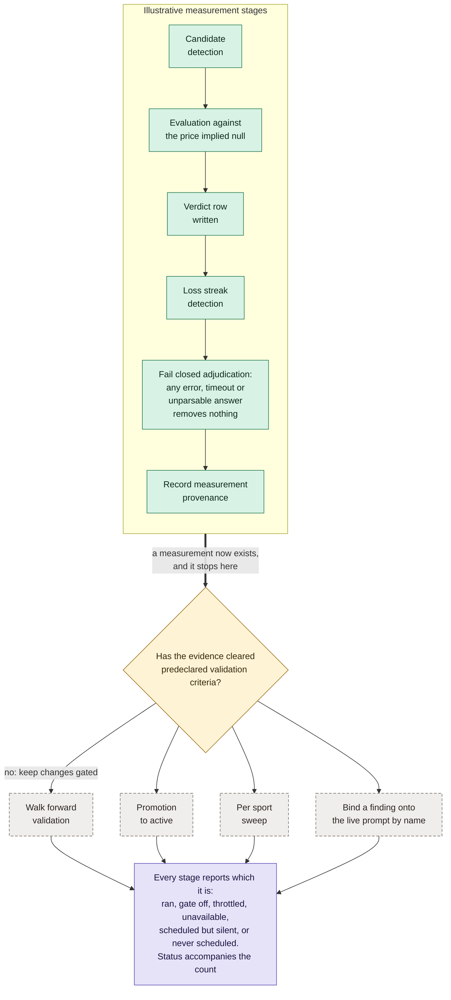

# The skill lifecycle: measure before promotion

An illustrative design separates measurement from permission to change behavior.
This is a design pattern, not an inventory of private running services.

**What it shows.** Candidate evaluation and promotion are separate decisions.
A stage reports whether it ran, was gated off, failed, or was not scheduled.
The diagram does not claim an implemented scheduler or a live deployment.

**Where this is rendered.** `polymind/README.md`, under "Measurement before
behavior changes".

**Related examples.** `polymind/evidence_gate.py`, `polymind/posterior.py`,
and `polymind/honest_states.py` demonstrate component concepts. They do not
implement this full lifecycle.
