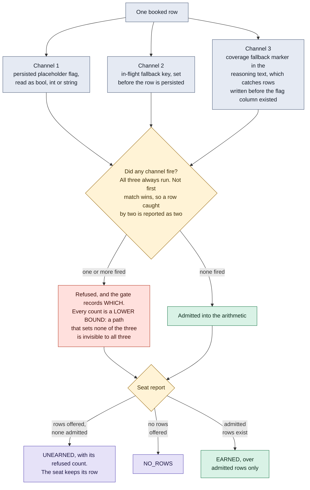

# The evidence gate: three channels, and why a seat can report unearned

When a provider does not answer, the row still has to be filled or coverage
silently drops, so a clearly marked placeholder is written. That is honest at
write time. The dishonesty happens later, when something counts those rows.

**What it shows.** Three independent channels, because any single one leaks.
The persisted flag misses a row that never got the column. The in-flight key
misses a row written before that code path existed. The text marker catches
rows written before the flag column existed at all. Any one firing disqualifies
the row, and the gate records which fired.

The subtle half is the right hand side. Filtering placeholders out of the
arithmetic is correct. Dropping the seat from the report is not. A seat that
exists and has earned nothing is a different fact from a seat that does not
exist, and rendering them the same way turns "we measured this and it is empty"
into "there is nothing here". So an all placeholder seat reports UNEARNED, and
a seat that is absent from the ledger entirely is absent from the report, which
is the fourth and different fact.

**Checkable against.** `polymind/evidence_gate.py`: `screen`, the three channel
constants, `seat_report` and its three non collapsed outcomes, and
`counts_are_a_lower_bound`. Tests in `tests/test_evidence_gate.py`.
