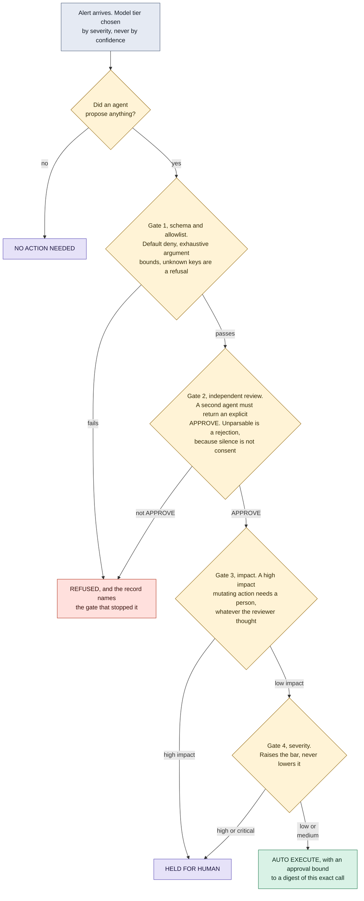

# Gates that can only subtract

A multi-agent SOC triage pipeline where an action executes on its own only if
every gate says yes, and no gate can ever raise the answer.

**What it shows.** Four outcomes, and the two that a dashboard usually merges
are opposites: NO ACTION NEEDED means nothing needed doing, HELD FOR HUMAN
means something needed doing and is waiting for a person. A dashboard that only
tracks whether an action ran renders both as "no action", which is how a queue
of pending containment goes unnoticed.

Note where severity enters. It chooses the model tier at the top and it raises
the bar at the bottom, and it is never allowed to authorize an action on its
own. That separation exists because the first version of this pipeline computed
execution from severity alone while a reviewer agent's verdict sat unread in
the response. The blast radius of being wrong is what scales, not the
confidence.

Approvals are bound to a digest of one exact tool and argument set, so an
approval for a lookup cannot be replayed onto a later account disable.

**Checkable against.** `ai_security/agentic_soc.py`: `Severity`,
`MODEL_BY_SEVERITY`, `HUMAN_REQUIRED_AT`, `review_action`, the `triage` gate
chain and `TriageRecord.render`, whose four outcome strings are the four leaves
here. `call_digest` and `validate_tool_call` live in
`ai_security/llm_output_validator.py`. Mapped to NIST AI RMF MANAGE 2.4,
OWASP LLM03:2026 Excessive Agency (LLM06:2025) and MITRE ATLAS AML.T0053.
