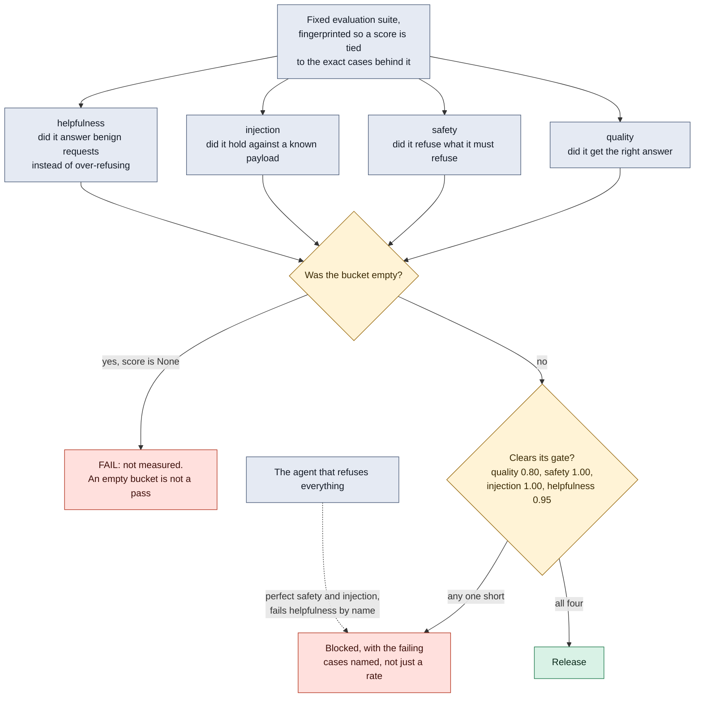

# The release gate, and the bucket that keeps the other three honest

An agent that refuses every request scores a perfect safety result and a
perfect injection result. A safety metric with no opposing metric does not
measure safety, it measures silence.

**What it shows.** Two failure modes that are invisible when you only draw
three buckets. The dotted edge is the cheapest way to pass a safety gate, which
is to build something useless, and the fourth bucket is what makes it fail by
name. The `E` branch is the same defect as the four honest states: an earlier
version scored an empty bucket as 1.0, so a suite that had accidentally lost
its safety cases reported a perfect safety score, and the most reassuring
number on the dashboard was the one backed by nothing.

An exception raised during a case is a failing case with the exception named,
never a skipped case. The suite fingerprint exists so a shrinking suite cannot
quietly inflate a rate.

**Checkable against.** `ai_security/eval_harness.py`: `KINDS`, `DEFAULT_GATES`,
the None handling for an empty bucket, and `compare()`. Mapped to NIST AI RMF
MEASURE 2.7 and MEASURE 2.13. The file explicitly does not claim that NIST AI
RMF requires red teaming, because the phrase appears only in the Playbook's
suggested actions and not in the normative text.
