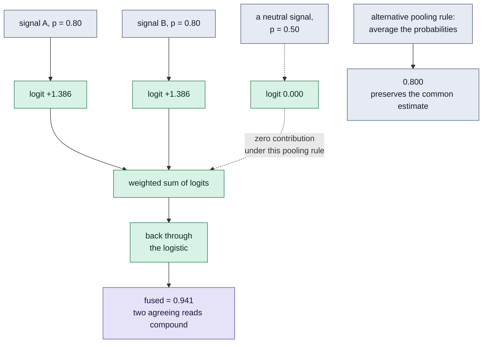

# Log-odds pooling and averaging

Two pooling rules produce different results from the same inputs. This diagram
shows their arithmetic, not a ranking of forecast quality.

**What it shows.** With unit weights, summing the logits of two 0.80 inputs
and applying the logistic function produces 0.941. A 0.50 input has zero logit
and contributes nothing under this rule. Averaging two identical 0.80 inputs
preserves their common value instead.

**Limits.** A Bayesian evidence-combination interpretation requires compatible
priors and conditionally independent evidence. Shared priors and overlapping
sources can be counted repeatedly. Neither increased confidence nor a neutral
0.50 contribution establishes calibration or improved accuracy.

**Reproduce it.** `python3 polymind/signal_fusion.py` prints `0.941` for the two
0.80 inputs and `0.800` for a 0.80 input pooled with 0.50.

**Where this is rendered.** The `signal_fusion.py` section of
`polymind/README.md` contains the identical diagram. The root README links to
that section.

**Checkable against.** `polymind/signal_fusion.py` and
`tests/test_signal_fusion.py`. The outputs demonstrate the function's arithmetic,
not returns, predictive accuracy, or realized results.
