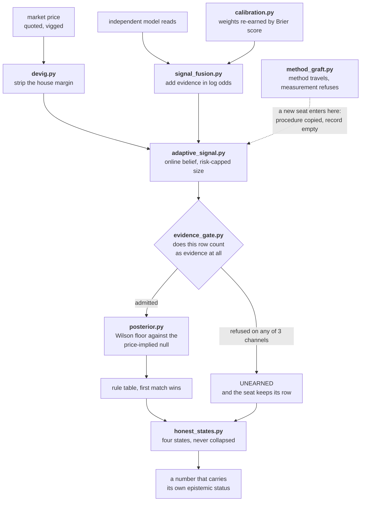
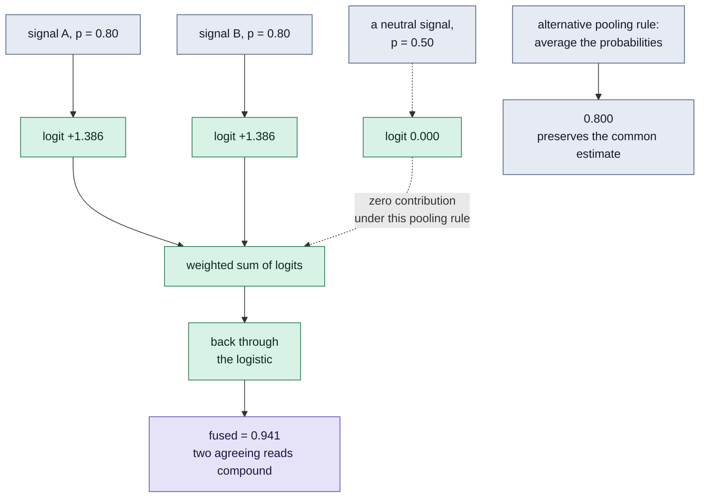
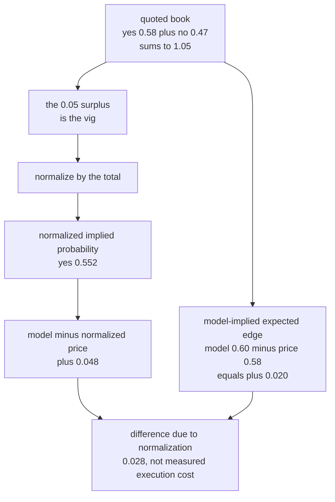
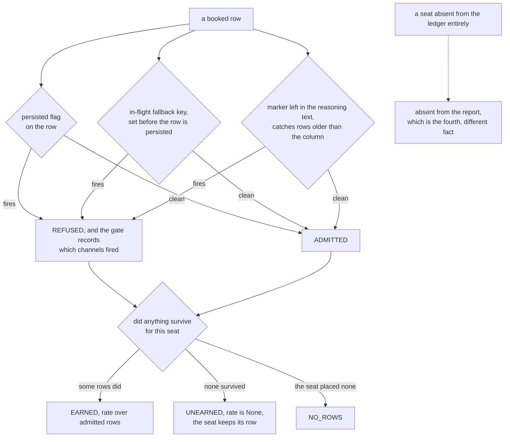
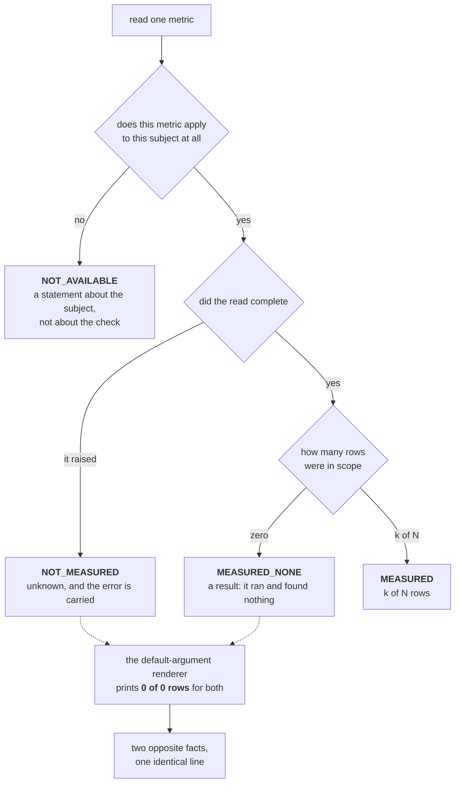
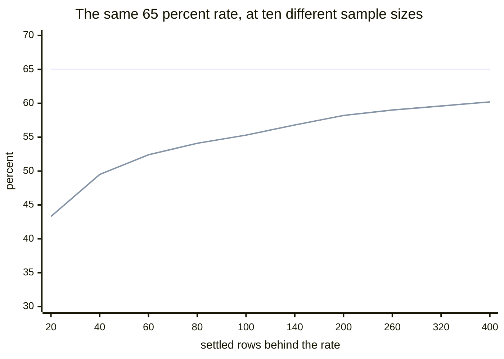
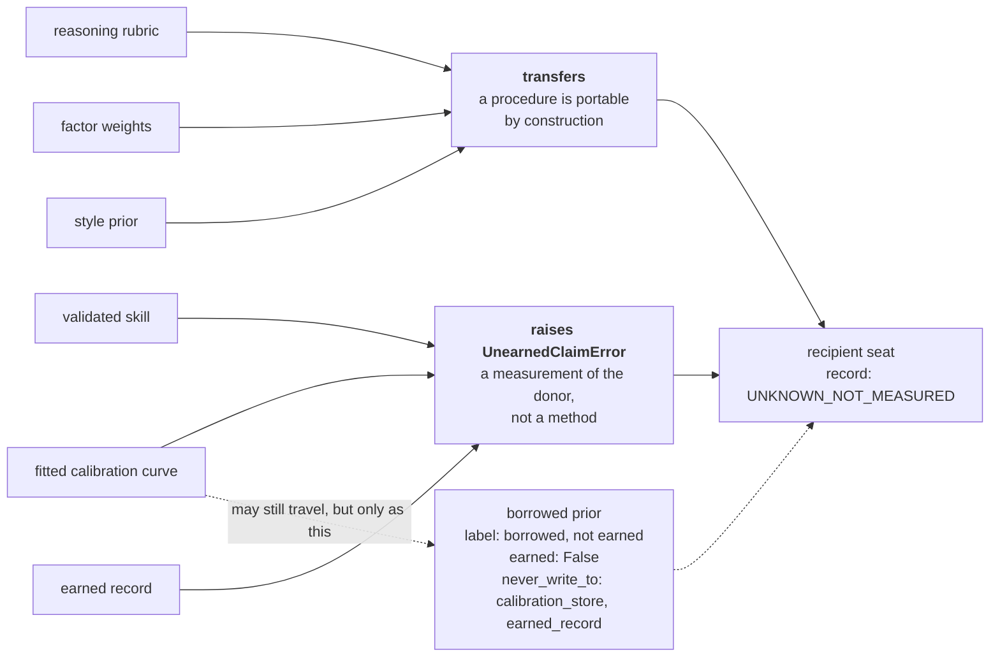
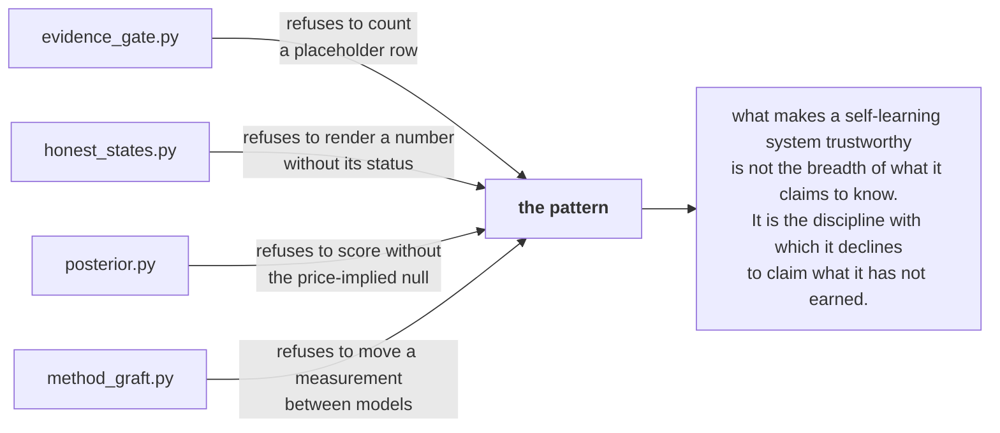
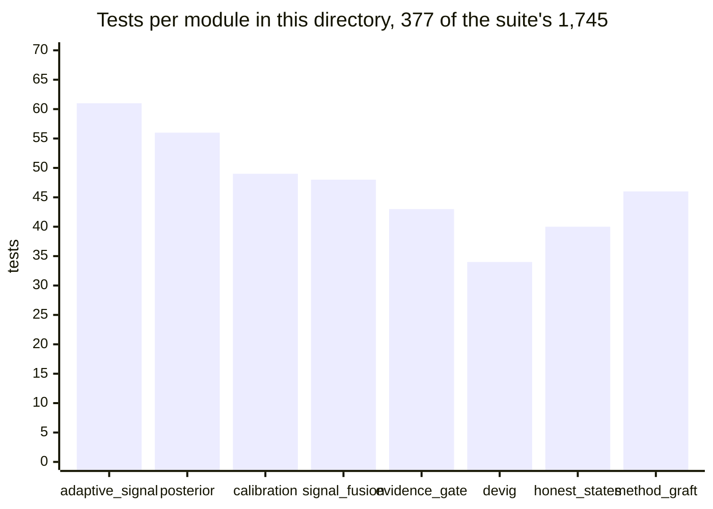
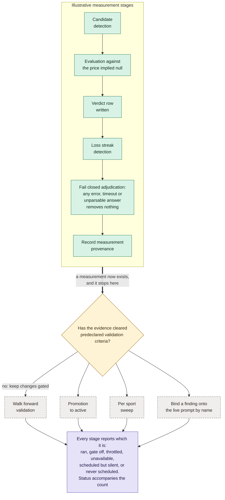

# 🤖 PolyMind

<div align="center">

**Eight dependency-free modules for evidence gating, calibration, and measured decisions.**


</div>

Standalone examples from my private multi-model research platform. They
demonstrate evidence gating, probability calculations, and measurement controls
using synthetic inputs.

**Scope.** These examples use synthetic inputs and place no real orders.
They do not report investment performance or private deployment status.
The [public architecture showcase](https://polymindatlas.greeklinux.dev)
provides additional design context.

> [!TIP]
> Every block of output on this page was produced by running the file next to
> it, using synthetic inputs. Clone the repository and reproduce any
> of them:
> ```bash
> python3 polymind/signal_fusion.py
> ```

## The defect behind each module

Each of the eight is here because a specific naive version of it failed in a
specific way. The table explains the failure modes these examples address;
it is not a private incident report.

| # | The job | How the naive version failed | What runs now | File |
| --- | --- | --- | --- | --- |
| 1 | Compare probability-pooling rules. | Pooling without stating assumptions can double-count shared evidence or misinterpret agreement. | Weighted **log-odds** are summed; 0.50 contributes zero under this rule. Prior and dependence assumptions require separate justification. | [`signal_fusion.py`](signal_fusion.py) |
| 2 | Compare a forecast with quoted and normalized prices. | Treating normalized implied probabilities as known truth, or model-price differences as realized profit. | Report the difference from the normalized book and from the quoted price separately. Neither is an observed return. | [`devig.py`](devig.py) |
| 3 | Weight the sources in an ensemble. | A static weight is a guess that never expires, so a source that goes cold keeps its vote indefinitely. | Weight is re-earned every window from the Brier score and floored at zero, so confidence without accuracy is punished rather than rewarded. | [`calibration.py`](calibration.py) |
| 4 | Size a position from the model's confidence. | Raw Kelly on a large edge asks for a fraction of the bankroll no single position should ever hold. | Kelly is clamped to a hard cap, and a decision failing either floor returns `hold` **with the reason attached** rather than as silence. | [`adaptive_signal.py`](adaptive_signal.py) |
| 5 | Fill a missing provider answer with a marked placeholder. | A downstream consumer can mistake marked placeholder rows for observed outcomes. | One predicate, **three independent channels**, every count declared a lower bound, and the seat keeps its row rather than vanishing from the report. | [`evidence_gate.py`](evidence_gate.py) |
| 6 | Read a metric and render it. | `store.get(key, 0)` renders a failed read as `0 problems found`: the most reassuring line on the screen, for the worst thing that can happen to it. | Four states decided in a fixed order, applicability decided **before** the read is attempted, and the naive renderer kept in the file so the difference is visible rather than asserted. | [`honest_states.py`](honest_states.py) |
| 7 | Decide whether a seat has earned its record. | Scored against a coin flip, a seat that only ever backed the favourite in a book of heavy favourites looks skilled forever while contributing nothing. | A Wilson lower bound against the **price-implied null**, resolved through an ordered rule table printable as data, and a refusal to score at all when the null is missing. | [`posterior.py`](posterior.py) |
| 8 | Copy what works from a seat that works. | Copying the fitted calibration curve too means the recipient begins life already claiming to be well calibrated, so nobody can tell whether the graft worked. | Method transfers. Measurement raises `UnearnedClaimError`. A curve may travel only as a labelled **borrowed prior**, barred from the calibration tables. | [`method_graft.py`](method_graft.py) |

> [!NOTE]
> Rows 5 through 8 are the ones I would actually defend in an interview. Rows 1
> through 4 are about being *honestly right*, and correct arithmetic is table
> stakes. The failures that survive are the ones where the arithmetic ran fine
> on evidence that should never have been admitted, or where the result was
> rendered in a way that cannot distinguish a clean answer from a broken pipe.

## How they fit together

One claim walking the whole path: priced, fused, weighted, sized, screened,
scored, and finally rendered in a form that cannot lie about its own status.



The first four are about being **honestly right**. The last four are about
something harder, and they are the part I would actually defend in an
interview.

## What is here

| File | The idea in one line | |
| --- | --- | --- |
| [`signal_fusion.py`](signal_fusion.py) | Demonstrate weighted **log-odds pooling** and its assumptions. | [read](#signal_fusionpy) |
| [`devig.py`](devig.py) | Normalize a quoted book and distinguish two model-price comparisons. | [read](#devigpy) |
| [`calibration.py`](calibration.py) | Sources **re-earn** influence from verified results. | [read](#calibrationpy) |
| [`adaptive_signal.py`](adaptive_signal.py) | An online belief with **risk-capped** sizing. | [read](#adaptive_signalpy) |
| [`evidence_gate.py`](evidence_gate.py) | A claim has to **clear a gate** before it counts as evidence. | [read](#evidence_gatepy) |
| [`honest_states.py`](honest_states.py) | Four states, **never collapsed**. The strongest idea here. | [read](#honest_statespy) |
| [`posterior.py`](posterior.py) | Score against **the price**, not a coin flip, through a printable rule table. | [read](#posteriorpy) |
| [`method_graft.py`](method_graft.py) | Method transfers between models. **Measurement refuses to.** | [read](#method_graftpy) |

---

## `signal_fusion.py`

**Compare log-odds pooling with probability averaging.**

This function sums weighted logits and applies the logistic function. With
unit weights, two 0.80 inputs produce about 0.94; a 0.50 input contributes
zero. Averaging those two identical inputs instead returns 0.80.

These are different pooling rules, not a universal ranking of methods. A
Bayesian evidence-combination interpretation requires compatible priors and
conditionally independent evidence. Summing posterior logits can count a shared
prior repeatedly, and correlated sources can count the same evidence twice.
This example does not estimate those dependencies or establish better accuracy.
A 0.50 input is neutral under this rule, not necessarily under every prior.

| Inputs | Result | Interpretation under the specified rule |
| --- | --- | --- |
| average of two 0.80 inputs | `0.800` | preserves their common estimate |
| unit-weight log-odds pooling of two 0.80 inputs | `0.941` | adds their logits |
| log-odds pooling of 0.80 and 0.50 | `0.800` | the zero logit leaves the result unchanged |



The zero at the middle branch follows from `logit(0.50) = 0`. A positive-weight
average of 0.80 and 0.50 lies between them. Neither property alone establishes
which pooled forecast will be better calibrated or more accurate.

<details>
<summary><b>The real run</b> &nbsp; <code>python3 signal_fusion.py</code></summary>

```text
naive average : 0.800
log-odds fused: 0.941   <- two agreeing signals raise conviction
strong + noise: 0.800   <- 0.5 adds nothing
```

The output labels are those printed by the example. Here, "noise" means a
0.50 input; it is not a measurement of source quality. The unchanged result
follows from its zero logit.

</details>

## `devig.py`

**Strip the vig before measuring edge.**

This example normalizes complementary quoted prices by their sum. For the
synthetic book below, the total exceeds one. Proportional normalization removes
that overround mathematically, but does not identify a uniquely correct market
belief or establish that all of the excess is a transaction fee.

The model's difference from the normalized probability describes disagreement
with this adjusted book. Its difference from the quoted price is model-implied
expected edge for a unit-payout contract, before fees, slippage, and execution
constraints. It is not realized profit, and depends on the model being correct.



<details>
<summary><b>The real run</b> &nbsp; <code>python3 devig.py</code></summary>

```text
raw prices      : {'yes': 0.58, 'no': 0.47}
de-vigged (true): {'yes': 0.552, 'no': 0.448}
edge vs market's true belief : +0.048
realized edge after the vig  : +0.020
the vig you paid             : +0.028   <- the cost most people never subtract
```

The preserved example output uses "true" and "realized" as labels. The
calculations do not establish either: `+0.048` is a difference from a
normalized implied probability, while `+0.020` is a model-price difference.
The `+0.028` gap is the normalization adjustment, not an observed fee or return.

</details>

## `calibration.py`

**Sources re-earn influence from verified results.**

The rolling Brier score determines each source's weight. As a proper scoring
rule, it rewards truthful probability reports in expectation under its
assumptions. This does not prevent selection bias, outcome leakage, or noisy
finite-sample rankings. Independent evaluation data remain necessary.

The mechanism is the Brier score, which grades a probabilistic forecast on
direction *and* confidence at once. A source sitting at coin-flip skill of 0.25
earns exactly zero weight. Nobody gets influence for free, and being loudly
wrong costs more than hedging.

<details>
<summary><b>The real run</b> &nbsp; <code>python3 calibration.py</code></summary>

Two sources see the same five outcomes. One forecasts them well. The other is
confidently wrong on every row.

```text
earned weights: {'stats_model': 1.0, 'hype_model': 0.0}
```

The loud source does not get a reduced vote. It gets **no** vote, because its
mean Brier score is worse than a coin flip and the weight floor is zero. That
is the intended shape: influence is a thing you earn back every window, not a
thing you keep by default.

</details>

## `adaptive_signal.py`

**An online belief with risk-capped sizing.**

The estimate updates incrementally and the proposed stake fraction is capped
for each call. This does not cap cumulative exposure, correlated positions, or
portfolio losses. The Beta-style update is an illustrative belief mechanism;
its confidence value is not an empirically validated accuracy guarantee.

The sizing half matters as much as the belief half. Kelly sizing is clamped to
a hard cap, so the answer to "the model is very sure" is never "bet the book".

<details>
<summary><b>The real run</b> &nbsp; <code>python3 adaptive_signal.py</code></summary>

Five noisy signals leaning YES, against a market lagging at 0.55.

```text
learned fair value: 0.654
decision: {'action': 'buy_yes', 'fair_value': 0.6543, 'market_price': 0.55, 'edge': 0.1043, 'stake_fraction': 0.05, 'confidence': 0.857}
```

Look at `stake_fraction`. Raw Kelly on an edge that size asks for far more than
five percent of the bankroll. It returns `0.05` because the cap is the cap. The
decision also carries its own `edge` and `confidence`, so the reason it fired
is readable without rerunning anything, and a decision that fails either floor
comes back as `hold` with the reason attached instead of as silence.

</details>

## `evidence_gate.py`

**A claim has to clear a gate before it counts as evidence.**

A provider fallback can produce a marked placeholder rather than an observed
answer. Downstream consumers must preserve that distinction when counting
outcomes or selecting training evidence. This example screens three marker
channels and keeps excluded rows visible in the report.

One predicate, three independent channels, because any single channel leaks:



> [!WARNING]
> Counts produced this way are a **lower bound, never a total**. A placeholder
> path that sets none of the three channels is invisible to all three, so every
> row of the report carries `counts_are_a_lower_bound: True` rather than
> implying a census the gate cannot deliver.

**The part people get wrong.** Filtering placeholders out of the *arithmetic*
is correct. Dropping the seat from the *report* is not. A seat that exists and
has earned nothing is a different fact from a seat that does not exist, and
rendering them the same way turns "we measured this and it is empty" into
"there is nothing here".

<details>
<summary><b>The real run</b> &nbsp; <code>python3 evidence_gate.py</code></summary>

```text
{'seat': 'seat_north', 'offered': 9, 'refused': 1, 'counts_are_a_lower_bound': True, 'unreadable_outcomes': 0, 'state': 'EARNED', 'counted': 8, 'rate': 0.625}
{'seat': 'seat_south', 'offered': 6, 'refused': 6, 'counts_are_a_lower_bound': True, 'state': 'UNEARNED', 'rate': None}
{'seat': 'seat_east', 'offered': 0, 'refused': 0, 'counts_are_a_lower_bound': True, 'state': 'NO_ROWS', 'rate': None}

naive rate for seat_south, placeholders counted: 0.667  <- a 0.667 record built entirely out of coin flips
channels that caught its rows: ('fallback_key',)
seat_west is not in the report at all, because it does not exist,
which is a different fact from seat_east having earned nothing.
```

`seat_south` is the whole point. Counted naively it is a 0.667 performer and it
would sit on a leaderboard above `seat_north`. Screened, its rate is `None` and
its state is `UNEARNED`, and it is **still on the page** with its refused count
visible. Three seats, three different states, and not one of them is a zero.

</details>

## `honest_states.py`

**Four states, never collapsed.**

The single most valuable idea here, and the cheapest one to implement.
Almost every dashboard has the same defect. A number is fetched with a default
argument of zero, the fetch fails, the default arm supplies the zero, and the
page renders `0 problems found`: the most reassuring output the screen can
produce, for the worst thing that can happen to it.



Applicability is decided **before** the read is attempted, on purpose: "this
subject has no such metric" is a fact you already know, and it must not be
discovered as a read failure.

<details>
<summary><b>The real run</b> &nbsp; <code>python3 honest_states.py</code></summary>

Four keys. One holds rows, one is empty, one is unreadable, one does not apply.

```text
alerts           MEASURED         3 of 4 rows
drift            MEASURED, NONE   0 of 0 rows (ran, zero rows in scope)
integrity        NOT MEASURED     unknown (ReadFailure: backend refused the read for 'integrity')
latency          NOT AVAILABLE    metric does not apply here

the same two reads through the usual default-argument renderer:
drift            0 of 0 rows
integrity        0 of 0 rows
  <- identical output for 'ran and found nothing' and 'never ran'
```

The last three lines are the demonstration, and the naive renderer is kept in
the file on purpose so the difference is visible rather than asserted. `drift`
is a clean empty result. `integrity` is a backend that refused the read. The
usual renderer prints the same eleven characters for both, and the one it
flatters is the failure.

</details>

## `posterior.py`

**Evidence to a decision, against the price rather than a coin flip.**

A Beta posterior shrinks the point estimate toward the prior, so nine wins out
of twelve stops reading as a 0.75 forecaster. A Wilson lower bound at 95
percent is quoted instead of the point estimate, because it answers "what is
the worst this could plausibly be" and collapses toward nothing on small
samples by itself.

Then the comparison that actually matters. **The null is not a coin flip.** A
seat that only ever backed the favourite in a book of heavy favourites will hit
the favourite rate forever while contributing nothing. The bar is the null the
price already implies: the rate you would have got by taking the pre-decision
favourite on exactly the same rows. Scoring against 0.50 is how matching the
market gets paid like skill. This module **refuses to score without that null**
rather than falling back to a majority-class baseline, because the fallback is
the bug.

The margin over the null resolves through an ordered table, first match wins.
The table is data: you can print it, diff it, and put it in front of somebody
who does not read Python. A threshold nobody can see is a threshold nobody is
checking.

| n at least | margin at least | Action | Rule |
| --- | --- | --- | --- |
| 40 | `+0.08` | `MINT_AS_WARMING` | clears the null with room |
| 40 | `+0.00` | `HOLD_AND_REMEASURE` | ahead of the null, thinly |
| 40 | `-1.00` | `EVALUATED_NEUTRAL` | measured, nothing beat the null |
| 0 | `-1.00` | `NOT_MEASURED_ENOUGH` | below the sample floor |

Three seats through it. Read the first row twice:

| Seat | Raw rate | Wilson 95 floor | Price-implied null | Margin | Action |
| --- | --- | --- | --- | --- | --- |
| **A**, 74 of 120 | `0.6167` | `0.5273` | `0.6083` | `-0.081` | `EVALUATED_NEUTRAL` |
| **B**, 57 of 90 | `0.6333` | `0.5302` | `0.4444` | `+0.0858` | `MINT_AS_WARMING` |
| **C**, 9 of 12 | `0.75` | `0.4677` | `0.4167` | `+0.051` | `NOT_MEASURED_ENOUGH` |

Seat A beats a coin flip on its lower bound and still loses to the book it
traded in. Seat C has the best raw rate on the page and earns nothing, because
twelve rows is not a measurement.

**Why the sample floor is not arbitrary.** Hold a seat's raw rate fixed at
exactly 65 percent and grow only the number of settled rows behind it. The rate
never moves. The number the module actually quotes climbs for a long time.



**Derivation.** The flat line is the raw rate, pinned at 65 percent. The rising
line is `wilson_lower_bound(0.65 * n, n)` called directly from
[`posterior.py`](posterior.py) at each of those ten sample sizes, multiplied by
100. Every sample size chosen is one where `0.65 * n` is a whole number, so the
raw rate really is identical on every point rather than approximately so.

Read the gap rather than either line. At 20 rows the module quotes 43.3 percent
for a seat whose raw record says 65, and it is right to: that is genuinely the
worst the truth could plausibly be. At 400 rows it quotes 60.2. The seat did not
get better. The **evidence** got better, and the quoted number is a statement
about the evidence rather than about the seat. The sample floor of 40 sits where
it does because below it the bound collapses toward nothing on its own, and a
number that collapses on its own does not need a person to remember to discount
it.

<details>
<summary><b>The real run</b> &nbsp; <code>python3 posterior.py</code></summary>

```text
the rule table, as data:
  n >= 40  margin >= +0.08   MINT_AS_WARMING      clears the null with room
  n >= 40  margin >= +0.00   HOLD_AND_REMEASURE   ahead of the null, thinly
  n >= 40  margin >= -1.00   EVALUATED_NEUTRAL    measured, nothing beat the null
  n >= 0   margin >= -1.00   NOT_MEASURED_ENOUGH  below the sample floor

A: 74 of 120, in a book where the favourite hit 73 of 120
  settled             120
  raw_rate            0.6167
  posterior_mean      0.6148
  wilson_lower_95     0.5273
  price_implied_null  0.6083
  margin_over_null    -0.081
  rule                measured, nothing beat the null
  action              EVALUATED_NEUTRAL
  vs a coin flip its lower bound looks like an edge; vs the price it is not

B: 57 of 90, in a book where the favourite hit 40 of 90
  settled             90
  raw_rate            0.6333
  posterior_mean      0.6304
  wilson_lower_95     0.5302
  price_implied_null  0.4444
  margin_over_null    0.0858
  rule                clears the null with room
  action              MINT_AS_WARMING

C: 9 of 12, a hot start
  settled             12
  raw_rate            0.75
  posterior_mean      0.7143
  wilson_lower_95     0.4677
  price_implied_null  0.4167
  margin_over_null    0.051
  rule                below the sample floor
  action              NOT_MEASURED_ENOUGH
```

Every intermediate is in the trace, not just the verdict. That is deliberate:
the person reviewing the call needs to see which number moved it.

</details>

## `method_graft.py`

**Method transfers between models. Measurement refuses to.**

A rubric, factor weights and a style prior are a *procedure*, so they port. A
fitted calibration curve and an earned record are *measurements of one specific
model*, produced by its own prompt, temperature and mix of picks. Copying
either is not a transfer, it is a forgery with a plausible number on it.



**Why the refusal is load-bearing.** A grafted seat starts unmeasured and has
to earn its own curve. That is not a shortcoming, it is the entire point: copy
the curve too and the recipient begins life already claiming to be well
calibrated, so nobody can ever tell whether the graft worked. It is a raised
error rather than a silent skip, because a silent skip produces a plan that
looks complete and quietly is not.

<details>
<summary><b>The real run</b> &nbsp; <code>python3 method_graft.py</code></summary>

Six items requested. Three port, three do not, and every one of the six appears
in the plan, because a plan that silently omits what it refused is not an
answer to what was asked.

```text
transferred: ['price_discipline_rubric', 'factor_weight_vector', 'opening_style_lens']
recipient record after the graft: UNKNOWN_NOT_MEASURED
refused:
  fitted_reliability_curve   kind 'calibration' may never move between seats: it is a measurement of the donor, not a method
  validated_skill_on_row     kind 'skill' may never move between seats: it is a measurement of the donor, not a method
  season_win_loss            kind 'earned_record' may never move between seats: it is a measurement of the donor, not a method

the donor's curve still travels, but only like this:
  donor                          donor_seat_1
  curve                          [{'forecast': 0.55, 'observed': 0.51}, {'forecast': 0.65, 'observed': 0.63}, {'forecast': 0.75, 'observed': 0.66}]
  settled_rows_behind_it         214
  label                          borrowed, not earned
  earned                         False
  recipient_calibration_state    UNKNOWN_NOT_MEASURED
  never_write_to                 ['calibration_store', 'earned_record']

a direct attempt raises rather than skipping: kind 'calibration' may never move between seats: it is a measurement of the donor, not a method
```

The donor's curve is not destroyed, it is *labelled*. It travels as a borrowed
prior with the donor named, the sample size behind it stated, `earned: False`,
and an explicit list of the stores it may never be written to. The recipient's
own calibration state stays `UNKNOWN_NOT_MEASURED` until it settles enough of
its own outcomes to replace it.

</details>

---

## The through line

The first four are about being **honestly right**: fuse evidence correctly,
compare forecasts with quoted and normalized prices, weight sources by their
measured scores, and cap each proposed stake. Each mechanism has stated limits.

The next four are about something harder. Getting the arithmetic right is table
stakes. The failures that survive are the ones where the arithmetic ran fine on
evidence that should never have been admitted, or where the result was rendered
in a way that cannot distinguish a clean answer from a broken pipe, or where a
number was credited to a model that did not produce it.

So: a gate that decides what counts as evidence at all. A four-state vocabulary
so a failed read can never render as a reassuring zero. A null that is the
market price rather than a coin flip, resolved through a rule table you can
print. And a hard line between the method you may copy from a model that works
and the measurements you may not.

Almost every one of those is a **refusal**. That is the pattern worth noticing.



## Measured



**Derivation.** Each bar is the `Ran N tests` line from
`python3 -m unittest tests.test_<module>`, run on its own. The eight sum to
**377**, and the four directories sum to the 1,712 the whole suite reports.

The ordering is not a quality ranking. [`adaptive_signal.py`](adaptive_signal.py)
carries the most, at 61, because a Kelly clamp, two floors and a `hold` that has
to arrive with its reason are four separate places to be wrong on every input.
[`posterior.py`](posterior.py) is next, at 56, and for the same kind of reason: a
rule table with four ordered rows, a sample floor, a Wilson bound, and a refusal
path when the null is absent. The two at the bottom are
[`method_graft.py`](method_graft.py) at 40 and [`devig.py`](devig.py) at 34, each
a smaller calculation with a refusal path. Counts describe suite size rather
than implementation quality.

Every module here is also checked for non-vacuity by planting a one-line
mutation in a scratch copy of the tree and confirming the suite turns red.
**Thirty eight (38) mutations across these eight modules, every one caught, 150 test
deaths.** Reproduce it with
`python3 tests/mutation_harness.py --module polymind/<name>.py`, or run the
whole set in about four minutes. The mutations are declared as data in
[`../tests/mutations.py`](../tests/mutations.py), each naming the property it is
supposed to break, and the harness and its conventions are described in
[`../tests/README.md`](../tests/README.md).

## Architecture principles

These examples are standalone demonstrations. Private model rosters, deployment
states, operational thresholds, and incident history are intentionally omitted.
The public [architecture showcase](https://polymindatlas.greeklinux.dev)
provides a separate conceptual walkthrough.

### Measurement before behavior changes

The following is an illustrative lifecycle, not a live service inventory.
Measure candidates, validate on held-out evidence, and require an explicit
promotion decision before a finding changes behavior.



A stage should distinguish a completed measurement from a disabled gate, a
failed read, or a scheduled task that never ran. A zero count alone cannot
communicate those different states.

## Scope and limits

An engineer reading this should know where the edges are, so here they are.

- **These are slices, not the engine.** Weights, calibration windows,
  thresholds, rolling decay, correlation handling and the live strategy are
  private and are outside this example repository.
- **Every input on this page is synthetic.** The numbers in the worked runs are
  real outputs of real code over invented inputs. They demonstrate a mechanism.
  They are not a record.
- **No real performance is claimed.** Worked rates and model-price differences
  are synthetic demonstration outputs, not private trading records, realized
  returns, or evidence of investment performance.


- **`evidence_gate.py` counts are a lower bound, never a census.** A placeholder
  path that sets none of the three channels is invisible to all three. A count
  of what you caught is never a count of what is there.

## Running them

Standard library only. No install step, no virtualenv, no network, no clock, no
unseeded randomness. Every file runs on its own and prints its own worked
example:

```bash
python3 polymind/signal_fusion.py
python3 polymind/devig.py
python3 polymind/calibration.py
python3 polymind/adaptive_signal.py
python3 polymind/evidence_gate.py
python3 polymind/honest_states.py
python3 polymind/posterior.py
python3 polymind/method_graft.py
```

There is one test file per module under [`../tests`](../tests), named as
sentences that state the property under test, and the conventions behind them
are written up in [`../tests/README.md`](../tests/README.md).

```bash
make test
```

*All examples use synthetic inputs. Weights, calibration windows, thresholds,
rolling decay, correlation handling and the live strategy are private.*

## The themes this directory carries

The five ideas that run through all four directories, and where this one sits in
each. The full cross-cut, with every instance file-linked, is
[`../docs/THEMES.md`](../docs/THEMES.md).

| Theme | What this directory contributes |
| --- | --- |
| [1. A control written and not in effect](../docs/THEMES.md#1--a-control-that-is-written-and-not-in-effect) | The placeholder rows that were counted, and the default argument that renders a failed read as a clean zero. |
| [2. Fail closed](../docs/THEMES.md#2--fail-closed-as-a-discipline-rather-than-a-slogan) | [`posterior.py`](posterior.py) refuses to score without the null. [`method_graft.py`](method_graft.py) raises rather than skipping. [`evidence_gate.py`](evidence_gate.py) publishes a lower bound rather than a total. |
| [3. Four states, never collapsed](../docs/THEMES.md#3--four-states-never-collapsed) | **The home of this theme.** [`honest_states.py`](honest_states.py) is the canonical statement, and three other modules apply it. |
| [4. Method you may copy, measurement you may not](../docs/THEMES.md#4--a-method-you-may-copy-a-measurement-you-may-not) | **The home of this theme.** [`method_graft.py`](method_graft.py) draws the line, [`calibration.py`](calibration.py) makes influence re-earnable, [`posterior.py`](posterior.py) makes the null specific to the rows it was measured on. |
| [5. An approval names one exact action](../docs/THEMES.md#5--an-approval-names-one-exact-action) | **Absent, correctly.** Nothing here has a human approval in its path. These modules decide what counts as evidence, which is a different question from who authorized an action. |

<div align="center">

[`../README.md`](../README.md) &nbsp;&middot;&nbsp;
[`ai_security/`](../ai_security/README.md) &nbsp;&middot;&nbsp;
[`blackgate/`](../blackgate/README.md) &nbsp;&middot;&nbsp;
[`automation/`](../automation/README.md) &nbsp;&middot;&nbsp;
[`../docs/THEMES.md`](../docs/THEMES.md) &nbsp;&middot;&nbsp;
[`tests/`](../tests/README.md)

</div>
